# MagPy
**MagPy (or GeomagPy) is a Python package for analysing and displaying geomagnetic data.**

Version Info: (please note: this package is still in a development state with frequent modifcations) please check the release notes.

MagPy provides tools for geomagnetic data analysis with special focus on typical data processing routines in observatories. MagPy provides methods for data format conversion, plotting and mathematical procedures with specifically geomagnetic analysis routines such as basevalue and baseline calculation and database handling. Among the supported data formats are *ImagCDF, IAGA-02, WDC, IMF, IAF, BLV*, and many more.
Full installation also provides a graphical user interface, *xmagpy*. You will find a complete manual for *xmagpy* in the docs.

Typical usage of the basic MagPy package for reading and visualising data looks like this:

        #!/usr/bin/env python

        from magpy.stream import read
        import magpy.mpplot as mp
        stream = read('filename_or_url')
        mp.plot(stream)

Below you will find a quick guide to usage of the basic MagPy package. For instructions on *xmagpy* please refer to the document "[An introduction to XMagPy]" in the docs. You can also subscribe to our information channel at [Telegram] for further information on updates and current issues.

### Contents

1. Installation and requirements
2. Quick guide with often used commands
3. Reading and writing, data typs
4. Figures
5. Timeseries methods
6. Annotating data and flagging
7. DI-flux measurements, basevalues and baselines
8. Geomagnetic activity analysis
9. Database support
10. Additional tools and applications

## 1. INSTALLATION AND REQUIREMENTS

In the following you will find a quick summary on how to install MagPy2.x on various different operating systems.
If you are looking for instructions on how to install the graphical version "XMagPy" versions 2.x please consult
the appropriate manual. Some general instructions for XMagPy are listed in section 1.x.

We highly recommend installing MagPy in appropriate python environments (Python>=3.7). Within
the following instructions we will show examples specifically for anaconda/miniconda
python environments.

### 1.1 Prerequisites

MagPy requires Python3.7 or newer. MagPy makes use of a number of modules of which the following are 
essential for its basic functionality: 
numpy
scipy
matplotlib

Optional but recommended python modules are:
cdflib : support of ImagCDF, the INTERMAGNET one-second format, and internal MagPy CDF archives)
jupyter-notebook : coding
pandas : timeseries manipulation (flagging and activity analysis)
pymysql : mysql/mariaDB data base support
paho-mqtt : realtime data access of MARTAS
pysubpub :  realtime data access of MARTAS
emd : empirical mode decomposition for Sq (solar quiet) analysis and flagging
sklearn : AI flagging support and geomagnetic activity forcasts

### 1.2 Linux installation (Ubuntu,Debian like systems)

#### 1.2.1 Recommended: Using environments
In the following we assume a basic knowledge of linux systems and installations. 
You need a working version of anaconda or miniconda.

  - we recommend [Miniconda] or [Anaconda]
  - see e.g. https://docs.continuum.io/anaconda/install for more details
  - before continuing, test whether python is working. Open a terminal and run python

Now open a terminal and create a python environment with packages for magpy which supports jupyter-notebook and includes essential packages:

        (base)$ conda create -n jnmagpy scipy numpy matplotlib notebook

Switch into this environment:

        (base)$ conda activate jnmagpy

Install some basic packages for full MagPy support:

        (jnmagpy)$ conda install pymysql

and finally MagPy:

        (jnmagpy)$ pip install geomagpy

Now you can run python in the terminal and import the magpy package:

        (jnmagpy)$: python
        >>> from magpy.stream import *
        >>> data = read("path_to_supported_data")

To upgrade to the most recent version (replace x.x.x with the current version number):

        $ pip install geomagpy==x.x.x

Running magpy within jupyter-notebook. First switch to a path were you want to store your notebooks:

        (jnmagpy)$: cd ~/MyNotenooks
 
and then start jupyter-notebook

        (jnmagpy)$: juypter-notebook

This will open a browser window. Please follow the jn instruction here

To use MagPy import and select an appropriate backend:

        > from magpy.stream import *
        > matplotlib.use("tkagg")
        > %matplotlib inline

#### 1.2.2 Not-Recommended: Using system python

Make sure to install most required packages using *apt install* before installing geomagpy

        $ sudo apt install python3-scipy python3-numpy python3-matplotlib python3-pip

Optional but recommended packages are 

        $ sudo apt install python3-pymysql python3-pandas python3-wxgtk4.0 libproj-dev proj-data proj-bin

Now install geomagpy and its remaining dependencies

        $ sudo pip3 install geomagpy

### 1.3 MacOs installation

Please also use a python environment for MacOs usage

  - we recommend [Miniconda] or [Anaconda]
  - see e.g. https://docs.continuum.io/anaconda/install for more details
  - before continuiung, test whether python is working. Open a terminal and run python

Follow the instructions of 1.2.

### 1.4 Windows installation

#### 1.4.1 Install MagPy for Windows

  - get the [MagPy Windows installer] here (under Downloads):
        https://cobs.geosphere.at
  - download and execute magpy-x.x.x.exe
  - all required packages are included in the installer

#### 1.4.2 Post-installation information

  - MagPy will have a sub-folder in the Start menu. Here you will find three items:

        * command -> opens a DOS shell within the Python environment e.g. for updates
        * python  -> opens a python shell ready for MagPy
        * xmagpy  -> opens the MagPy graphical user interface

#### 1.4.3 Update an existing MagPy installation on Windows

  - right-click on subfolder "command" in the start menu
  - select "run as administrator"
  - issue the following command "pip install -U geomagpy"
    (you can also specify the version e.g. pip install geomagpy==0.x.x)

### 1.5 Installing XMagPy on Linux/MacOs

XMagPy is making use of wxpython. Basically we are mainly testing the linux version 
of this application and try to keep up with support for other operating systems. We highly recommend
to follow the instructions below.

#### 1.5.1 XMagPy prerequisites on Linux

WX support requires the following package.

        $ sudo apt-get install python3-wxgtk4.0

In order to get a suitable python environment for wxpython you then need to create a new one based on wxpython

        (base)$ conda create -n wxmagpy wxpython

Then install the essential packages:

        (base)$ conda activate wxmagpy

        (wxmagpy)$ conda install numpy scipy matplotlib

Continue with the optional packages as shown in 1.2
Finally you can run the graphical user interface as follows:

        (wxmagpy)$ xmagpy

#### 1.5.2 Creating a desktop link for Linux

#### 1.5.3 XMagPy on MacOs

Follow the instructions of 1.5.1.

You can now run XMagPy from the terminal by using the following command

        $ xmagpyw

#### 1.5.4 Creating a desktop link for MacOs

To execute a python program within a specific environment it is recommended to create a small startupscript i.e. named xmagpy:

        #!/bin/bash
        eval "$(conda shell.bash hook)"
        conda activate magpy
        xmagpyw

Make it executable e.g. by chmod 755 xmagpy.
Open Finder and search for your script "xmagpy". Copy it to the desktop. To change the icon, click on the xmagpy link, open information and replace the image on the upper left with e.g. magpy128.jpg (also to be found using finder).

### 1.6 Platform independent container - Docker

#### 1.6.1 Install [Docker] (toolbox) on your operating system
     - https://docs.docker.com/engine/installation/

#### 1.6.2 Get the MagPy Image
     - open a docker shell

            >>> docker pull geomagpy/magpy:latest
            >>> docker run -d --name magpy -p 8000:8000 geomagpy/magpy:latest

#### 1.6.3 Open a browser
     - open address http://localhost:8000 (or http://"IP of your VM":8000)
     - NEW: first time access might require a token or passwd

            >>> docker logs magpy

          will show the token
     - run python shell (not conda)
     - in python shell

            >>> %matplotlib inline
            >>> from magpy.stream import read
            >>> import magpy.mpplot as mp
            >>> data = read(example1)
            >>> mp.plot(data)

## 2. A quick guide to MagPy

written by R. Leonhardt, R. Bailey (April 2017)

MagPy's functionality can be accessed basically in three different ways:
    1) Directly import and use the magpy package into a python environment
    2) Run the graphical user interface xmagpy (xmagpyw for Mac)
    3) Use predefined applications "Scripts"

The following section will primarily deal with way 1.
For 2 - xmagpy - we refer to the specfic xmagpy manual can be found in the download section of 
the [Conrad Observatory Webpage](https://cobs.geosphere.at).
Predefined applications/scripts are summarized in the appendix.

### 2.1 Getting started with the python package

Start python. Import all stream methods and classes using:

    from magpy.stream import *

Please note that this import will shadow any already existing `read` method.

## To be moved elsewhere

### 2.2 MagPy's internal data structure

Data is stored in form of an numpy array. Meta information will be organized within a dictionary. Both structures together from a data stream object.
For data treatment each input column is assigned to an internal key. The name of this key has not necessarily anything to do with the type/name of data.

**key** refers to the internally used columnname

**name** refers to the contents asigned to a key

**unit** refers to the units of the contents

print(trimstream.get_key_name('x'))

### 2.3 Getting help on options and usage

#### 2.3.1 Python's help function

Information on individual methods and options can be obtained as follows:

For basic functions:

        help(read)

For specific methods related to e.g. a stream object "data":

        help(data.fit)

Note that this requires the existence of a "data" object, which is obtained e.g. by data = read(...). The help text can also be shown by directly calling the *DataStream* object method using:

        help(DataStream().fit)

#### 2.3.2 MagPy's logging system

MagPy automatically logs many function options and runtime information, which can be useful for debugging purposes. This log is saved by default in the temporary file directory of your operating system, e.g. for Linux this would be `/tmp/magpy.log`. The log is formatted as follows with the date, module and function in use and the message leve (INFO/WARNING/ERROR):

        2017-04-22 09:50:11,308 INFO - magpy.stream - Initiating MagPy...

Messages on the WARNING and ERROR level will automatically be printed to shell. Messages for more detailed debugging are written at the DEBUG level and will not be printed to the log unless an additional handler for printing DEBUG is added.

Custom loggers can be defined by creating a logger object after importing MagPy and adding handlers (with formatting):

        from magpy.stream import *
        import logging

        logger = logging.getLogger()
        hdlr = logging.FileHandler('testlog.log')
        formatter = logging.Formatter('%(asctime)s - %(name)s - %(levelname)s - %(message)s')
        hdlr.setFormatter(formatter)
        logger.addHandler(hdlr)

The logger can also be configured to print to shell (stdout, without formatting):

        import sys
        logger = logging.getLogger()
        stdoutlog = logging.StreamHandler(sys.stdout)
        logger.addHandler(stdoutlog)

## 3. Reading and writing data

MagPy supports many different data formats and thus conversions between them. For geomagnetic purposes
the most important are listed below.

   - WDC: 	World Data Centre format
   - JSON: 	JavaScript Object Notation
   - IMF: 	Intermagnet Format
   - IAF: 	Intermagnet Archive Format
   - IAGA: 	IAGA 2002 text format
   - IMAGCDF: 	Intermagnet CDF Format
   - GFZKP: 	GeoForschungsZentrum KP-Index format
   - GSM19/GSM90: 	Output formats from GSM magnetometers
   - POS1: 	POS-1 binary output
   - LEMI: 	LEMIXXX binary output
   - BLV: 	Baseline format Intermagnet
   - IYFV: 	Yearly mean format Intermagnet
   - DKA: 	K Value file

... and many others. To get a full list, use:

        from magpy.stream import *
        print(PYMAG_SUPPORTED_FORMATS)

You will find several example files provided with MagPy. The `cdf` file is stored along with meta information in NASA's common data format (cdf). Reading this file requires a working installation of Spacepy cdf.

If you do not have any geomagnetic data file you can access example data by using the following command (after `import *`):

        data = read(example1)

The data from `example1` has been read into a MagPy *DataStream* (or *stream*) object. Most data processing routines in MagPy are applied to data streams.

Several example data sets are provided within the MagPy package:

   - `example1`: [IAGA] ZIP (IAGA2002, zip compressed) file with 1 second HEZ data
   - `example2`: [MagPy] Archive (CDF) file with 1 sec F data
   - `example3`: [MagPy] Basevalue (TXT) ascii file with DI and baseline data
   - `example4`: [INTERMAGNET] ImagCDF (CDF) file with one week of 1 second data
   - `example5`: [MagPy] Archive (CDF) raw data file with xyz and supporting data
   - `example6a`: [MagPy] DI (txt) raw data file with DI measurement
   - `example6b`: [MagPy] like 6a to be used with example4

   - `flagging_example`: [MagPy] FlagDictionary (JSON) flagging info to be used with example1
   - `recipe1_flags`: [MagPy] FlagDictionary (JSON) to be used with cookbook recipe 1

### 3.1 Reading

For a file in the same directory:

        data = read(r'myfile.min')

... or for specific paths in Linux:

        data = read(r'/path/to/file/myfile.min')

... or for specific paths in Windows:

        data = read(r'c:\path\to\file\myfile.min')

Pathnames are related to your operating system. Hereinafter we will assume a Linux system in this guide. Files that are read in are uploaded to the memory and each data column (or piece of header information) is assigned to an internal variable (key). To get a quick overview of the assigned keys in any given stream (`data`) you can use the following method:

        print(data._get_key_headers() )

### 3.2 Other possibilities for reading files

To read all local files ending with .min within a directory (creates a single stream of all data):

        data = read(r'/path/to/file/*.min')

Getting magnetic data directly from an online source such as the WDC:

        data = read(r'ftp://thewellknownaddress/single_year/2011/fur2011.wdc')

Getting *kp* data from the GFZ Potsdam:

        data = read(r'http://www-app3.gfz-potsdam.de/kp_index/qlyymm.tab')

(Please note: data access and usage is subjected to the terms and conditions of the individual data provider. Please make sure to read them before accessing any of these products.)

No format specifications are required for reading. If MagPy can handle the format, it will be automatically recognized.

Getting data for a specific time window for local files:

        data = read(r'/path/to/files/*.min',starttime="2014-01-01", endtime="2014-05-01")

... and remote files:

        data = read(r'ftp://address/fur2013.wdc',starttime="2013-01-01", endtime="2013-02-01")

Reading data from the INTERMAGNET Webservice:

        data = read('https://imag-data-staging.bgs.ac.uk/GIN_V1/GINServices?request=GetData&observatoryIagaCode=WIC&dataStartDate=2021-03-10T00:00:00Z&dataEndDate=2021-03-11T23:59:59Z&Format=iaga2002&elements=&publicationState=adj-or-rep&samplesPerDay=minute')

### 3.3 Writing

After loading data from a file, we can save the data in the standard IAGA02 and IMAGCDF formats with the following commands.

To create an IAGA-02 format file, use:

        data.write(r'/path/to/diretory/',format_type='IAGA')

To create an [INTERMAGNET] CDF (ImagCDF) file:

        data.write(r'/path/to/diretory/',format_type='IMAGCDF')

The filename will be created automatically according to the defined format. By default, daily files are created and the date is added to the filename in-between the optional parameters `filenamebegins` and `filenameends`. If `filenameends` is missing, `.txt` is used as default.

To get an overview about possible write options use:

        help(DataStream().write)

### 3.4 Format-specific options

Some file formats contain multiple data sources and when writing certain archive formats, additional information will bve save in separate files. Below you will find descriptions for such format-specific pecularities.

#### 3.4.1 IAF format

The IAF (INTERMAGNET archive format) contains 1-minute data along with filtered 1-hour data and daily averages. Typically components X,Y,Z and delta F (G) values are provided. Beside the geomagnetic components, the K indicies (3 hour resolution) are also contained within  the IAF structure.
When reading IAF data, by default only the 1-minute data is loaded. If you want to access other resolutions data or K values you can use the following "resolution" options (hour, day, k) while reading (please note: XMagPy only allows for reading minute data):

        data = read('/path/to/IAF/*.bin', resolution='hour')

When writing IAF data, you need to provide 1-minute geomagnetic data covering at least one month. Hourly means, daily averages and, if not provided, k values are automatically determined using IAGA/IM recommendations and saved within the IAF structure. You can however provide k values also using an independent data stream with such data:

        data.write('/path/to/export/IAF/', kvals=k_datastream)

Additionally a README.IMO file will be created and filled with existing meta information. If at least on year of 1-minute data is written, then also a DKA file will be created containing K values separatly. Please checkout INTERMAGNET format specifications for further details on DKA, README and IAF formats.   

#### 3.4.2 IMF format

The IMF (INTERMAGNET format) is a seldom used ascii data file for one minute data products. The IMF format can be created from basically and data set in 1-minute resolution. Individual files cover one day. The data header of the IMF file contains an abbrevation of the geomagnetic information node GIN which by default is set to EDI (for Edinbourgh). To change that use the "gin" option.

        data.write('/path/to/export/IMF/', gin="GOL")

#### 3.4.3 IMAGCDF format

The IMAGCDF format can contain several data sets from different instruments represented by different time columns. Typical examples are scalar data with lower sampling resolution as vector data and/or temperature data in lower resolution.
MagPy's IMAGCDF library will read all those data sets and, by default, will only use the most detailed time column which typically is GeomagneticVectorTimes. Low resolution data will refer to this new time column and "missing values" will be represented as NaN.
The select options allows you to specifically load lower resolution data like scalar or temperature readings.  

        data = read('/path/to/IMAGCDF/*.cdf', select='scalar')

When writing IMAGCDF files MagPy is using np.nan as fill value for missing data. You can change that by providing a different fill value using the option fillvalue:

        data.write('/path/to/export/IMAGCDF/', fillvalue=99999.0)

MagPy is generally exporting IMAGCDF version 1.2 data files. Additionally, MagPy is also supports flagging information to be added into the IMAGCDF structure (IMAGCDF version 1.3, work in progress):

        data.write('/path/to/export/IMAGCDF/', addflags=True)

Hint for XMagPy: When reading a IMAGCDF file with mutiple data contents of varying sampling rates the plots of the lower resolution data are apparently empty. Got to "Plot Options" on the Data panel and use "plottype" -> "continuous" to display graphs of low resolution data sets.  

#### 3.4.4 IBFV baseline data

Baseline data can be read as any other timeseries data set in MagPy. Supported versions of IBFV are versions 1.2 and 
2.0 and  both are automatically recognized. When just loading the blv file without any additional options. Then the 
basevalue data will be stored within the datastream columns. Adopted baseline, as contained in the blv files, will not 
be read as data, but will extracted as well, approximated by simple spline functions, actually separate splines for all 
components, and the resulting adopted baseline function will be stored in the data sets header 'DataFunctionObject'. 
Discontinuities are considered in IBVF version 2.0. Please be aware, although this is a reasonable approximation of the
adopted baseline function, it not necessarily the an exact reproduction of the originally used adopted baseline. The
comment section of blv files is also extracted and stored in the data sets header. How to access and plot such 
basevalues and the adopted functions is shown here

        basevalues = read("/home/leon/Cloud/Daten/MagPyTestFiles/abk95.blv")
        func = basevalues.header.get('DataFunctionObject')
        mp.tsplot(basevalues, ['dx','dy','dz'], symbols=[['o','o','o']], functions=[[func,func,func]])

If you are mainly interested in the adopted baseline data you can use the read mode 'adopted'. This will then load only 
the adopted baseline data into the data columns. Function header will remain empty and measured basevalues will be 
ignored. This mode will give you an exact reproduction of the contained adopted baseline values.

        adoptedbase = read("/home/leon/Cloud/Daten/MagPyTestFiles/abk95.blv", mode='adopted')
        mp.tsplot(adoptedbase, ['dx','dy','dz'])

If you want to plot data and original adopted basevalues use

        mp.tsplot([basevalues,adoptedbase], [['dx','dy','dz']], symbols=[['o','o','o'],['-','-','-']])

The meta information is accessible within the data header. MagPy is designed to be strongly related to underlying 
instruments, as defined by SensorID's and PierID's. BLV files are strongly instrument related as the baseline is always
referring to a variometer and eventually also a scalar sensor. Another essential aspect is the pier at which DI
measurements are performed. MagPy's BLV DataID therefore typically look like BLV_VariometerID_ScalarID_PierID. If any
of this information is not contained in the blv comment section then the read command will assign dummy values like
VariometerIAGACODE, or SalarIAGACODE. The comment section can also be found in the data header. Give it a quick look

        print(basevalues.header)

### 3.5 Selecting timerange

The stream can be trimmed to a specific time interval after reading by applying the trim method, e.g. for a specific
month:

        data = data.trim(starttime="2013-01-01", endtime="2013-02-01")

### 3.6 An overview of all format libraries

| library                 | formats                      | since version | read/write | internal tests | requirements   |
|-------------------------|------------------------------|---------------|------------|----------------|----------------|
| format_abs_magpy.py     |                              |               |            |                |                |
| format_acecdf.py        |                              | 1.x           |            |                |                |
| format_autodif.py       |                              |               |            |                |                |
| format_autodif_fread.py |                              |               |            |                |                |
| format_basiccsv.py      | CSV                          | 2.0.0         | rw         | yes            | csv            |
| format_bdv.py           |                              | 1.x           |            |                |                |
| format_covjson.py       |                              |               |            |                |                |
| format_cr800.py         |                              | 1.x           |            |                |                |
| format_didd.py          |                              |               |            |                |                |
| format_dtu.py           |                              | 1.x           |            |                |                |
| format_gdas.py          |                              | 1.x           |            |                |                |
| format_gfz.py           |                              |               |            |                |                |
| format_gfztmp.py        |                              | 1.x           |            |                |                |
| format_gsm19.py         | GSM19                        | 2.0.0         | r          | untested       |                |
| format_hapijson.py      |                              |               |            |                |                |
| format_iaga02.py        | IAGA                         | 2.0.0         | rw         | yes            | pyproj         |
| format_imagcdf.py       | IMAGCDF                      | 2.0.0         | rw         | yes            | pyproj, cdflib |
| format_imf.py           | IAF, IMF, DKA, *BLV*, *IYFV* | 2.0.0         | rw         | yes            | pyproj         |
| format_iono.py          |                              |               |            |                |                |
| format_json.py          |                              |               |            |                |                |
| format_latex.py         |                              |               |            |                |                |
| format_lemi.py          |                              |               |            |                |                |
| format_magpy.py         | PYASCII, PYSTR, PYBIN        | 2.0.0         | rw,rw,r    | yes            | csv            |
| format_magpycdf.py      | PYCDF                        | 2.0.0         | rw         | yes            | cdflib         |
| format_nc.py            |                              | 1.x           | r          | defunc         | netcdf         |
| format_neic.py          | NEIC                         | 2.0.0         | r          | untested       |                |
| format_noaa.py          | NOAAACE                      | 2.0.0         | r          | no             |                |
| format_pha.py           |                              |               |            |                |                |
| format_pos1.py          |                              |               |            |                |                |
| format_predstorm.py     |                              |               |            |                |                |
| format_qspin.py         |                              | 1.x           |            |                |                |
| format_rcs.py           |                              |               | r          | defunc         |                |
| format_sfs.py           |                              |               |            |                |                |
| format_simpletable.py   |                              | 1.x           |            |                |                |
| format_tsf.py           | TSF                          | 2.0.0         | r          | untested       |                |
| format_wdc.py           |                              |               | rw         |                |                |
| format_wic.py           |                              |               |            |                |                |
| format_wik.py           |                              | 1.x           |            |                |                |
| magpy_absformats.py     |                              |               |            |                |                |
| magpy_formats.py        |                              |               |            |                |                |

## 4. Figures

You will find some example plots at the [Conrad Observatory](http://www.conrad-observatory.at).

### 4.1 A quick timersies plot

        import magpy.core.plot as mp
        mp.tsplot(data)

### 4.2 Often used options

Select specific keys to plot:

        mp.tsplot(data,['x','y','z'])

Defining a plot title and specific colors:

        mp.tsplot(data,keys=['x','y'],title="Test plot",
                colorlist=['g', 'c'])

Refining the y-axis range for the y colum between 0 and automatic maximum value (see `help(mp.plot)` for list and all options):

        mp.plot(data,variables=['x','y'],plottitle="Test plot",
                colorlist=['g', 'c'], specialdict = {'y':[0,]})

Changing size and appearance:

Many more examples are provided in chapter 5: 

### 4.3 Data from multiple streams

Various datasets from multiple data streams will be plotted above one another. Provide a list of streams and an array 
of keys:

        fig, ax = mp.tsplot([data1,data2],[['x','y','z'],['f']])

### 4.4 Getting an options overview

Various datasets from multiple data streams will be plotted above one another. Provide a list of streams and an array 
of keys:

        help(mp.tsplot)

## 5. Timeseries methods

Lets first load some example data set to demonstrate the application of basic data stream timeseries manipulation 
methods.

        data = read(example5)
        mp.tsplot(data, height=2)

### 5.1 Get some basic data characteristics and commonly used manipulations

#### 5.1.1 Basic data characteristics

Lets firstly check what data is actually contained in the data stream.
If you want to now which column keys are used in the current data set use

        print (data.variables())

Some basic column information, particularly column name and units as assigned to each column key can be obtained by

        print (data.get_key_name('x'))
        print (data.get_key_unit('x'))

The following command will give you a an overview about used keys and their asigned column names and units

        data._print_key_headers()

The amount of data in each column needs to be identical. You can check the length of all columns using

        print(data.length())

As all columns require the either the same length or zero length, you simply check the length of the time column
for the total amount of individual timesteps. This will be returned by the classic len command

        print(len(data))

#### 5.1.2 Modifying data columns

The following methods allow you modifying individual data columns, move them to other keys or add some new information
into your data set. Lets deal with another example for the following commands and extract data from key 'f' into a 
simple numpy array:

        fdata = read(example2)
        fcolumn = fdata._get_column('f')
        print (len(fcolumn))

Now we create a new data column filled with random values and insert it into key 'x'

        xcolumn = np.random.uniform(20950, 21000, size=len(fcolumn))
        fdata = fdata._put_column(xcolumn,'x')

Assign some variable name and unit to the new column and plot the new data set as shown in 
Figure 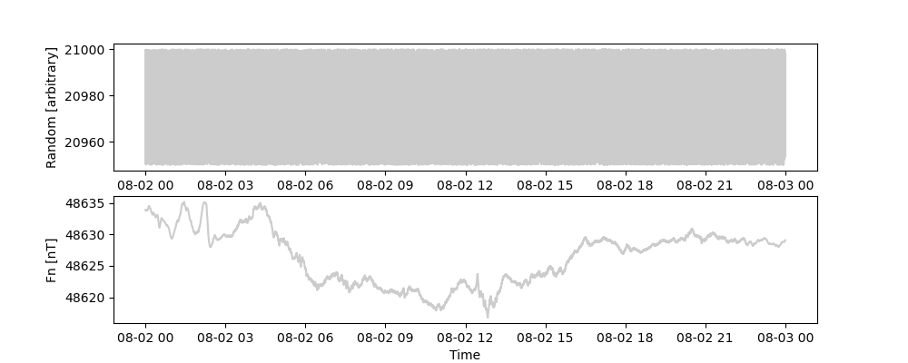

        fdata.header['col-x'] = 'Random'
        fdata.header['unit-col-x'] = 'arbitrary'
        mp.tsplot(fdata, height=2)

Other possibly commands to move, copy or drop individual columns are as follows

        fdata = fdata._copy_column('x','var1')
        fdata = fdata._move_column('var1','var2')
        fdata = fdata._drop_column('var2')

Creating a data set with selected keys can also be accomplished by

        fdata = fdata._select_keys(['f'])

If you want to extract data by some given threshold values i.e. get only data exceeding a certain value you should
have a look at the `extract` method. The extract method requires three parameters: the first one defining the column/key name
the second the threshold value, and the third one defines a comparator, which can be one of ">=", "<=",">", "<", "==", "!=",
default is "==". You can also apply the extract method on columns containing strings but then only with "==".

        extdata = fdata.extract("f" , 48625, ">")

Columns consisting solely of NaN values con be dropped using

        fdata = fdata._remove_nancolumns()

A random sub-selection of data can be obtained using `randomdrop`. The percentage defines the amount of data to be 
removed. You can also define indices which cannot be randomly dropped, the first and last point in our example below.

        dropstream = data.randomdrop(percentage=50,fixed_indicies=[0,len(data)-1])

As an example and for later we will add a secondary time column with a time shift to fdata

        tcolumn = fdata._get_column('time')
        newtcolumn = np.asarray([element+timedelta(minutes=15) for element in tcolumn])
        fdata = fdata._put_column(newtcolumn,'sectime')
        print (fdata.variables())

#### 5.1.3 All about time

To extract time constrains use the following methods:
Covered time range

        print (data.timerange())
        print (data.start())
        print (data.end())

The sampling period in seconds can be obtained as follows

        print (data.samplingrate())

Whenever you load data sets with MagPy the data will be sorted according to the primary time column
You can manually repeat that anytime using

        data = data.sorting()

If you want to select specific time ranges from the already opened data set you can use the `trim` method

        trimmeddata = data.trim(starttime='2018-08-02T08:00:00', endtime='2018-08-02T09:00:00')
        print(" Timesteps after trimming:", len(trimmeddata))

The trim method will create a new datastream containing only data from the selected time window. There is another
mainly internally used method `_select_timerange` which will do exactly the same as trim but returns only the
data array (ndarray) without any header information 

        ar = data._select_timerange(starttime='2018-08-02T08:00:00', endtime='2018-08-02T09:00:00')
        print(" Datatype after select_timerange:", type(ar))
        print(" Timesteps after _select_timerange:", len(ar[0]))

Inversely you can drop a certain time range out of the data set by

        ddata = data.remove(starttime='2018-08-02T08:00:00', endtime='2018-08-02T09:00:00')

Please note that the remove command removes all timesteps including the given starttime and endtime. 

Finally you can trim the given stream also by percentage or amount. This is done using the `cut` method and its
options. By default `cut` is using percentage. The following command will cutout the last 50% of data

        cutdata = fdata.cut(50,kind=0,order=0)
        print(cutdata.timerange())

Choosing option kind=1 will switch from percentage to amount and order=1 will take data from the beginning 
of the data set

        cutdata = fdata.cut(10,kind=1,order=0)
        print(cutdata.timerange())

The default key list of any MagPy data stream supports two time columns 'time' and 'sec_time'. The secondary time column
might be used to store an alternative time reading i.e. GPS dates in the primary columns and NTP time in the secondary
one. You can switch this columns using a single command.

        shifted_fdata = fdata.use_sectime()

If you want to get the line index number of a specific time step in your data series you can get it by

        index = fdata.findtime("2018-08-02T22:22:22")
        print(index)

### 5.2 Coordinate transformation and rotations

#### 5.2.1 Rotations

Lets first look at our example data set. The example is provided in HEZ components. In order to convert HEZ into XYZ 
components we simply need to rotate the data set by the declination value. You can achieve that by using the `rotation` 
method

        xyzdata = data.rotation(alpha=4.3)
        xyzdata.header['DataComponents'] = 'XYZ'
        xyzdata.header['col-x'] = 'X'
        xyzdata.header['col-y'] = 'Y'
        xyzdata.header['col-z'] = 'Z'
        mp.tsplot(xyzdata, height=2)

Vectorial data can be rotated using the `rotation` method by keeping F constant. Such rotations require just two angles 
which are referred to as *alpha* for rotations in the declination plane and *beta* for rotations in the inclination 
plane. Assume a simple vector x=4, y=0 and z=4. Rotation by alpha=45° will lead to x=2,y=2,z=4, a clockwise rotation.
Rotating by beta=45° will rotate F into the X-Y plane with x=4, y=4, z=0. Please note: you need to supply xyz data when 
applying the `rotation` method.

        rotdata = data.rotation(alpha=45,beta=45)

#### 5.2.2 Transforming coordinate systems

Assuming vector data in columns x,y,z you can freely convert between cartesian *xyz*, cylindrical *hdz*, and spherical
*idf* coordinates:

        hdzdata = xyzdata.xyz2hdz()
        mp.tsplot(hdzdata, height=2)

The summary method `_convertstream` can also be used by giving the conversion type as option. The following conversions 
are possible: 'xyz2hdz','hdz2xyz','xyz2idf','idf2xyz':

        xyzdata = hdzdata._convertstream('hdz2xyz')
        mp.tsplot(xyzdata, height=2)

The vectorial data columns as defined by the keys 'x','y','z' need to filled accordingly. i.e. a XYZ data stream has X 
in key 'x', Y in key 'y' and Z in key 'z', all with the same unit, usually nT in magnetism. A HDZ data stream as H 
assigned to key 'x', D in key 'y' and Z in key 'z'. H and Z are provided with the same unit (nT) and D has to be 
provided in degrees.decimals. IDF data contains I in key 'x', D in key 'y' and F in key 'z', with I and D provided in 
degree.decimals.

#### 5.2.3 Determining rotation angles

If you have a measurement (XYZ data) and would like to obtain the rotation values regarding and expected reference 
direction defined by *referenceD* reference declination and *referenceI* inclination, both given in degree.decimals 
you can use the following method. Let us apply this method to the original rotdata stream, which contains the HEZ data set 
rotated by alpha and beta of 45 degree. The HEZ data has an expected declination of 0 and and expected inclination
of 64.4 degree. Please note that these values are not exact:

        alpha, beta = rotdata.determine_rotationangles(referenceD=0.0,referenceI=64.4)
        print (alpha, beta)

The method will return angles with which rotdata needs to be rotated in order to get a non-rotated data set. Thus alpha 
and beta of -45 degree will be obtained.

### 5.3 Filtering and smoothing data

#### 5.3.1 General filter options and resampling

MagPy's `filter` uses the settings recommended by [IAGA]/[INTERMAGNET]. Ckeck `help(data.filter)` for further options 
and definitions of filter types and pass bands. Here is short list of supported filter types:
'flat','barthann','bartlett','blackman','blackmanharris','bohman','boxcar',
'cosine','flattop','hamming','hann','nuttall','parzen','triang','gaussian','wiener','butterworth'
Important options of the filter method, beside the chosen *filter_type* are *filter_width* which defines the window
width in a timedelta object and the *resample_period* in seconds defining the resolution of the resulting data set.
To get an overview over all filter_type and their basic characteristics you can run the following code. This will
calculate filtered one-minute data and then calculate and plot the power spectral density of each filtered data set.
Please note that we apply the *missingdata='interpolate'* option as the matplotlib.pyplot.psd method requires the data 
set being free of NaN values.

        filterlist = ['flat', 'barthann', 'bartlett', 'blackman', 'blackmanharris', 'bohman',
                              'boxcar', 'cosine', 'flattop', 'hamming', 'hann', 'nuttall', 'parzen', 'triang',
                              'gaussian', 'wiener', 'butterworth']
        for filter_type in filterlist:
            filtereddata = data.filter(filter_type=filter_type, missingdata='interpolate', filter_width=timedelta(seconds=120), resample_period=60)
            T = filtereddata._get_column('time')
            t = np.linspace(0,len(T),len(T))
            h = filtereddata._get_column('x') - filtereddata.mean('x')
            sr = filtereddata.samplingrate() # in seconds
            fs = 1./sr
            fig, (ax0, ax1) = plt.subplots(2, 1, layout='constrained')
            ax0.plot(t, h)
            ax0.set_xlabel('Time')
            ax0.set_ylabel('Signal')
            ax1.set_title(filter_type)
            power, freqs = ax1.psd(h, NFFT=len(t), pad_to=len(t), Fs=fs, scale_by_freq=True)
            plt.show()

The `filter` method will resample the data set by default towards a projected period. In order to skip resampling 
choose option *noresample=True*. You can apply the resample method also to any data set as follows. Resample will 
extract values at the given sampling interval or take the linear interpolated value between adjacent data points if no 
value is existing at the given time step.

        resampleddata = data.resample(['x','y','z'],period=60)
        print(len(resampleddata))
        print(resampleddata.timerange())

#### 5.3.2 Smoothing data

The `smooth` method is similar to the filter method without resampling. It is a quick method with only a limited amount 
of supported window types: flat, hanning (default), hamming, bartlett and blackman. The window length is given as number
of data points. Smooth will throw an error in case of columns with only NaN values, so make sure to drop them before

        data = data._remove_nancolumns()
        smootheddata = data.smooth(window='hanning', window_len=11)

#### 5.3.3 Filtering in geomagnetic applications

When dealing with geomagnetic data a number of simplifications have been added into the application. To filter the data 
set with default parameters as recommended by IAGA you can skip all the options and just call `filter`.
It automatically chooses a gaussian window with the correct settings depending on the provided sampling rate of the 
data set and filter towards the next time period i.e. if you supply 1sec, 5 sec or 10 sec period data they will be
filtered to 1 min. Therefore in basically all geomagnetic applications the following command is sufficient

        filtereddata = data.filter()

Get sampling rate and filtered data after filtering (please note that all filter information is added to the data's 
meta information dictionary (data.header):

        print("Sampling rate after [sec]:", filtereddata.samplingrate())
        print("Filter and pass band:", filtereddata.header.get('DataSamplingFilter',''))

#### 5.3.4 Missing data and its treatment

When dealing with geomagnetic data, especially when it comes to the frequency domain, then the treatment of missing 
data and  is of particular importance. The time domain should be evenly distributed and missing data needs to be 
adequately considered. Missing data is often replaced by unrealistic numerical values like 99999 or negative data. 
MagPy is using NaN values instead to internally treat such missing data. Two methods are available to help you 
preparing your data for frequency analysis. The `get_gaps` method will analyse the time column and 
identify any missing time steps for an equally distant time scale. Missing time steps will be filled in and NaNs will 
be added into the data columns. In order to deal with NaN values you can use filtering procedures as shown above or 
use the `interpolate_nan` method (section 5.9.2), which will linearly interpolate NaNs. Please be careful with these 
techniques as you might create spurious signals when interpolating.

        data = data.get_gaps()
        data = data.interpolate_nans(['x'])

The power spectral density can then be analyzed using build in python matplotlib methods. First extract time and data 
column.

        T = data._get_column('time')
        print (len(T))
        t = np.linspace(0,len(T),len(T))
        h = data._get_column('x')
        sr = data.samplingrate() # in seconds
        fs = 1./sr

Then plot timeseries of the selected data and psd.

        fig, (ax0, ax1) = plt.subplots(2, 1, layout='constrained')
        ax0.plot(t, h)
        ax0.set_xlabel('Time')
        ax0.set_ylabel('Signal')
        power, freqs = ax1.psd(h, NFFT=len(t), pad_to=len(t), Fs=fs, detrend='mean', scale_by_freq=True)
        plt.show()

#### 5.3.4 Quickly get daily mean values

Another method which belongs basically to the filter section is the the `dailymeans` method which allow you to 
quickly obtain dailymean values according to IAGA standards from any given data set covering at least one day.
Acceptable are all data resolutions as the dailymeans will filter the data stepwise until daily mean values.

        dailymeans = data.dailymeans()

### 5.4 Calculating vectorial F and delta F

Vectorial F can be easily calculated if the vectorial keys x,y,z are available. Lets start with examples1
from the provided data sets. Example1 contains a column filled with nan values for testing purposes.
We first remove this column (see also 5.1.2). 

        data = read(example1)
        data = data._remove_nancolumns()

Afterwards we check the available keys in the data set and see that x,y,z 
are available, a prerequisite to calculate the vector sum. We can also check what components are actually 
stored below keys x,y,z by checking the data's meta information. HEZ is perfectly fine for calculating
the vector sum.

        print(data.variables())
        print(data.header.get('DataComponents'))

The command 'calc_f` is now performing the calculation of the vector sum and stores it with key f

        data_with_F_v = data.calc_f()

Mostly however you will be interested not in vectorial F (F_V) but in delta values between F_V and a scalar F (F_S).
Lets read an independent F data set from example2, which covers a similar time range as vectorial data from example1.

        fdata = read(example2)

Let us assume you have two data sources variodata with X,Y,and Z data as well as scalardata with F. 
Make sure that both data sets cover the same time range and are sampled at the same frequency and time steps

        combineddata = merge_streams(data,fdata)   # checkout section 5.10 for details

Now the data file contains xyz (hdz, idf) data and an independently measured f value. You can calculate delta F 
between the two instruments using the following:

        combineddata = combineddata.delta_f()

Combined data will now contain an additional column at key 'df' containing F_v - F_s, 
the scalar pier difference as defined within the IM technical manual. The delta F values will added 
to key/column df (Figure 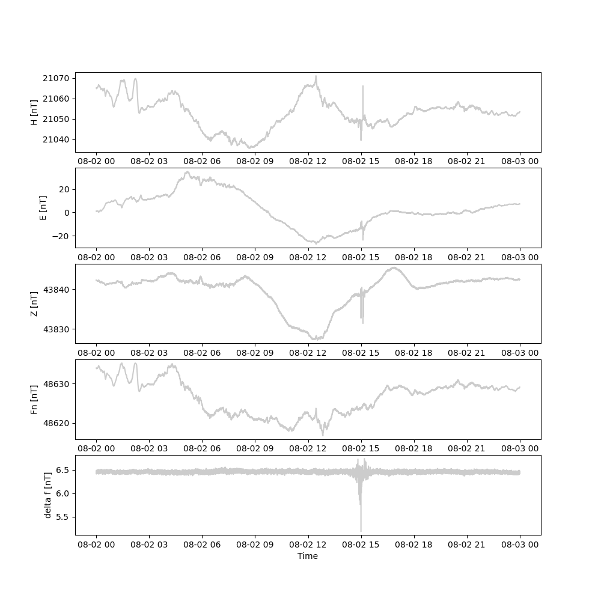):

        mp.tsplot(combineddata, keys=['x','y','z','f','df'], height=2)

### 5.5 Means, amplitudes and standard deviation

Mean values for certain data columns can be obtained using the `mean` method. The mean will only be 
calculated for data with the percentage of valid data points. By default 95% of valid data is required. 
You can change that by using the percentage option. In case of too many missing data points, then no mean 
is calculated and the function returns NaN.

        print(data.mean('x', percentage=80))

If you want also the standard deviation use option *std*:

        print(data.mean('x', percentage=80, std=True))

The median can be calculated by defining the `meanfunction` option:

        print(data.mean('x', meanfunction='median'))

The amplitude, the difference between maximum and minimum, can be obtained as follows

        print(data.amplitude('x'))

Just maximum and minimum values can be obtained with these methods

        print("Maximum:", data._get_max('x'))
        print("Minimum:", data._get_min('x'))

If you just need the variance you can either square the standrad deviation or use the `_get_variance` method

        print("Variance:", data._get_variance('x'))

### 5.6 Offsets and Scales

#### 5.6.1 Offsets

Constant offsets can be added to individual columns using the `offset` method with a dictionary defining 
the MagPy stream column keys and the offset to be applied (datetime.timedelta object for time column, float for all others):

        offsetdata = data.offset({'time':timedelta(seconds=0.19),'f':1.24})

#### 5.6.2 Scaling

Individual columns can also be multiplied by values provided in a dictionary:

        multdata = data.multiply({'x':-1})

### 5.7 Derivatives and integrating

Time derivatives, which are useful to identify outliers and sharp changes, are calculated based on successive
gradients based on numpy gradient. By using the option *put2keys* you can add the derivative to columns of your
choice. By default they are added to dx,,dy, dz, df.

        diffdata = data.derivative(keys=['x','y','z'],put2keys = ['dx','dy','dz'])
        mp.tsplot(diffdata,keys=['x','dx'], height=2)

We can also integrate the curve again based on scipy.integrate.cumtrapz. Use the `integrate`method for this purpose.
Integrate can only be applied to keys x,y,z,f and puts integrated data into columns dx,dy,dz,df. So sometimes you will
need to move data into the projected columns first. In the following we will move one of the earlier derived
columns towards x and then integrate. The correct scaling cannot be reconstructed and needs to be adjusted separately

        diffdata._move_column('dx','x')
        test = diffdata.integrate(keys=['x','y','z'])
        mp.tsplot(test,keys=['dx'], height=2)

### 5.8 Extrapolation

The extrapolation method `extrapolate` allows to extrapolate a  data set towards given start and end times. Several 
different methods are available for extrapolation: The most simple extrapolation method, which was already available
in MagPy 1.x is the duplication method (option: *method='old'*) which duplicates the first and last existing points 
at given times. New methods starting form 2.0 are the *'spline'* technique following 
[this](https://docs.scipy.org/doc/scipy/tutorial/interpolate/extrapolation_examples.html) approach, a *'linear'* 
extrapolation and a *'fourier'* technique as described [here](https://gist.github.com/tartakynov/83f3cd8f44208a1856ce).
Please note: the extrapolation method will remove any NaN columns and secondary time columns.

        data = read(example5)
        shortdata = data.trim(starttime='2018-08-29T09:00:00', endtime='2018-08-29T14:00:00')
        extdata = shortdata.extrapolate(starttime=datetime(2018,8,29,7), endtime=datetime(2018,8,29,16), method='fourier')

The different techniques will result in schemes as displayed in the following diagrams (not the example above):

1             |  2
:-------------------------:|:-------------------------:
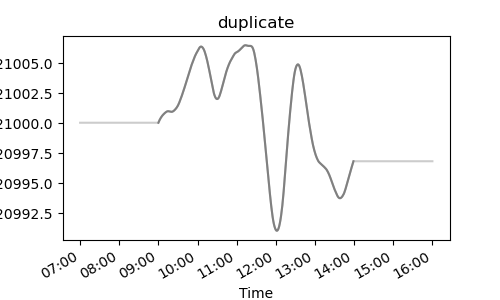  |  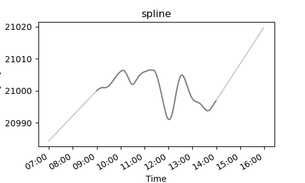
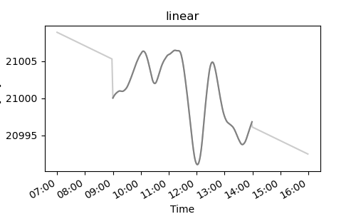  |  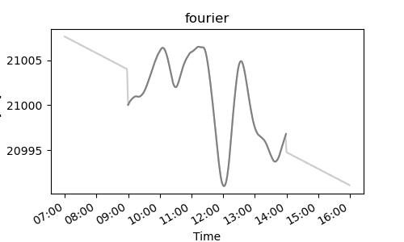

### 5.9 Functions

#### 5.9.1 Fitting data

MagPy offers the possibility to fit functions to data using a number of different fitting functions:

        func = data.fit(keys=['x','y','z'], fitfunc='spline', knotstep=0.1)
        mp.tsplot([data],[['x','y','z']],functions=[[func,func,func]])

Supported fitting functions *fitfunc* are polynomial 'poly', 'harmonic', 'least-squares', 'mean', 'spline'. The default 
fitting method is the cubic spline function 'spline'. You need to specific the option *fitdegree* for polynomial and 
harmonic fitting functions. *fitdegree*=1 corresponds to a linear fit. Default value is 5. For *fitfunc*='spline' you 
need to specify an average spacing for knots. The *knotstep* parameter will define at which percental distance a knot 
should be located. i.e. *knotstep*=0.33 would place altogether 2 knots at 33% within the timeseries. Smaller values 
will increase the number of knots and thus the complexity of the fit. Thus, *knotstep* need to contain a positive 
number below 0.5.

#### 5.9.2 Interpolation

The interpol method uses Numpy's interpolate.interp1d to interpolate values of a timeseries. The option *kind* defines 
the type of interpolation. Possible options are 'linear' (default), 'slinear ' which is a first order spline, 
'quadratic' = spline (second order), 'cubic' corresponding to a third order spline, 'nearest' values and 'zero'. The 
interpolation method can be used to interpolate missing data. Lets create put some data gaps into our example data set
for demonstration. We will use `randomdrop` to remove some data lines and then use `get_gaps` to identify this lines and
insert timesteps, but leaving values as NaN. Finally we can then interpolate missing data 

        discontinuousdata_with_gaps = data.randomdrop(percentage=10,fixed_indicies=[0,len(teststream)-1])
        print("Before: {}, After randdrop: {}".format(len(data), len(discontinuousdata_with_gaps)))
        continuousdata_with_gaps = discontinuousdata_with_gaps.get_gaps()

        contfunc = continuousdata_with_gaps.interpol(['x','y'],kind='linear')
        mp.tsplot([continuousdata_with_gaps],[['x','y','z']],functions=[[contfunc,contfunc,None]])

Another simple interpolation method allows for a quick linear interpolation of values, directly modifying the supplied 
timeseries (see also section 5.3.4).

        interpolatedts = continuousdata_with_gaps.interpolate_nans(['f'])

#### 5.9.3 Adopted baselines

Baselines are also treated as functions in MagPy. You can calculate the adopted baseline as follows. A more detailed 
description, also highlighting options for adopted baseline functions and jumps and all other aspects of
adopted baseline fitting are given in section 7.5. The baseline method will add functional parameter and basevalues
into the data header of variodata. You find these meta information in header keys 'DataAbsInfo' and
'DataBaseValues'. 'DataAbsInfo' contains the functional parameters of which the first two elements of each
function list describe the time range given in numerical matplotlib.dates.

        variodata = read(example5)
        basevalues = read(example3)
        func = variodata.baseline(basevalues)

#### 5.9.4 Functions within a DataStream object

The full function objects can be added to the timeseries meta information dictionary and stored along with the data set. Such Object 
storage is only supported for MagPy's PYCDF format. To add functions into the timeseries data header use:

        variodata = variodata.func2header(func)

When reading PYCDF data files and also INTERMAGNET IBLV data files then functional values (adopted baselines of BLV 
files) are available in the header. Access it as follows:

        blvdata = read(example7)
        func = blvdata.header.get('DataFunctionObject')
        mp.tsplot([blvdata],[['dx','dy','dz']], symbols=[['.','.','.']], padding=[[2,0.005,2]], symbolcolor=[[0.5, 0.5, 0.5]], functions=[[func,func,func]], height=2)

#### 5.9.5 Applying functions to timeseries

Functions can be transferred to data values and they can be subtracted for residual analysis. Use method func2stream 
for this purpose. You need to supply the functions to func2stream, define the keys and a mode on how functions are 
applied to the new timeseries. Possible modes are 'add', 'sub' for subtracting, 'div' for division, 'multiply' and
'values' to replace any existing data by function values. In order to analyse residuals for a adopted baseline function 
you would do the following: 

        residuals = blvdata.copy()
        residuals = residuals.func2stream(func, keys=['dx','dy','dz','df'],mode='sub')
        print(" Get the average residual value:", residuals.mean('dy',percentage=90))
        mp.tsplot([residuals],[['dx','dy','dz']], symbols=[['.','.','.']], height=2)

Replacing existing data by interpolated values can be accomplished using the `func2stream` method. Just recall the example
of 5.9.2, where we filled gaps by interpolation. Know we replace all existing inputs (data and NaNs) 
by interpolated values

        contfunc = continuousdata_with_gaps.interpol(['x','y','z'],kind='linear')
        data = data.func2stream(contfunc, keys=['x','y','z'],mode='values')

#### 5.9.6 Saving and reading functions separately

It is possible to save the functional parameters (NOT the functions) to a file and reload them for later usage. Please 
note that you will need to apply the desired fit/interpolation/baseline adoption again based on these parameters to 
obtain a function object. The parameters will be stored within a json dictionary.

        func_to_file(contfunc, "/tmp/savedparameter.json")

To read parameters in again 

        funcparameter = func_from_file("/tmp/savedparameter.json")

The variable funcparameters will then contain a dictionary with all contents of the original function list, including 
time ranges and specific parameters for each value. Extract these values by standard dict.get() and reapply to the data 
stream. 

### 5.10 Multiple timeseries

Unlike in the previous sections, the following multiple timeseries method descriptions are only accompanied by 
hypothetical data sets which are not part of the examples data sets.

#### 5.10.1 join

Let us assume you have two data sets, data1 containing X,Y,Z data and data2 containing X,Y,Z and F data with an 
overlapping time range. Such example data sets are shown in 
Figure 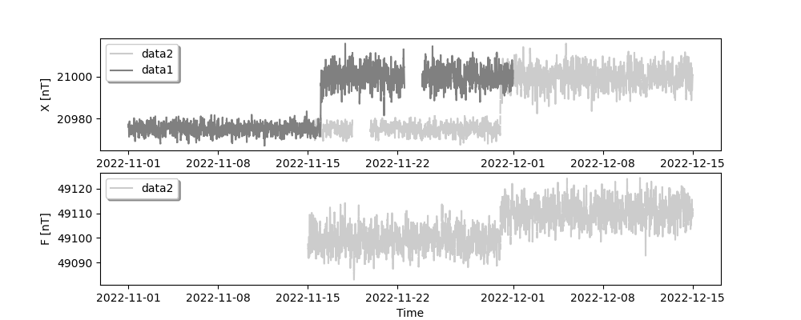. Now you have a 
number of different possibilities to combine these two data sets. First of all you can use the `join_streams` method 
which always will keep the first provided stream unchanged and add information from the second stream into the data set.

        joined_stream1 = join_streams(data1, data2)

This command will result in a joint data set containing all data from data1 and, outside the time range of data1, the 
data of data2 as shown in Figure 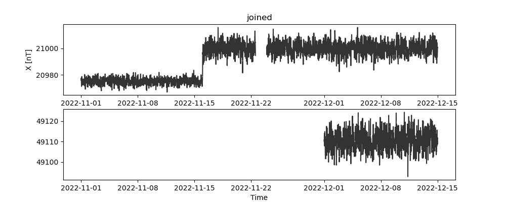. Calling the same function 
with a different order

        joined_stream1 = join_streams(data2, data1)

will result in a combination as shown in Figure 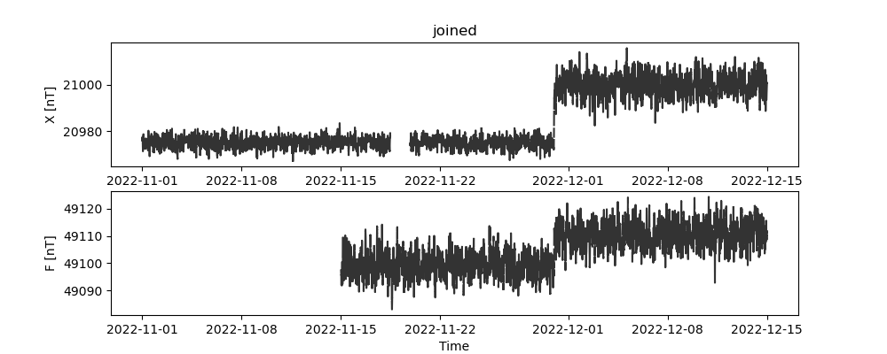. 
`join_streams` has no further options.

#### 5.10.2 merge

Merging data comprises combining two streams into one new stream. The two data sets on which `merge_streams` is applied 
need to have the same sampling rate and need to overlap in time. The method includes adding a new column from a second 
stream, filling gaps with data from another stream (mode='insert') or replacing data with contents from another stream 
(mode='replace'). The following examples sketch typical usages. Firstly, we use the default mode='insert': 

        merged_stream1 = merge_streams(data1, data2)

Application results in an addition of the f-column to stream1 and the filling of the data gap in data 1 with values of 
data2 (see Figure 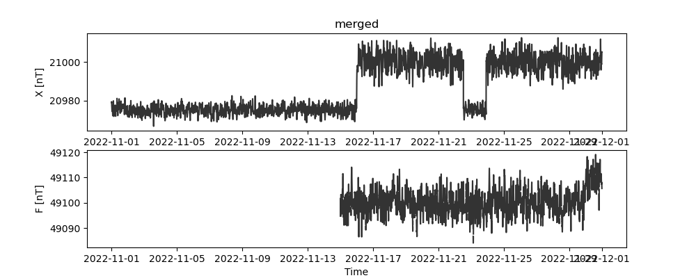.) The time range of the resulting stream will always cover 
the range of the data set provided first. Another option is demonstrated in the next example,
Here data 1 im merged into data2. Here we replace the contents of column y by existing contents of column y from data1. 
Data not existing in data1 will remain unchanged. 

        merged_stream1 = merge_streams(data2, data1, mode='replace', keys=['y'])

#### 5.10.3 subtract

Sometimes it is necessary to examine the differences between two data streams e.g. differences between the F values of 
two instruments running in parallel at an observatory. The method `subtract_streams` is provided for this analysis:

        diff = subtract_streams(data1,data2)

This command will result in Figure 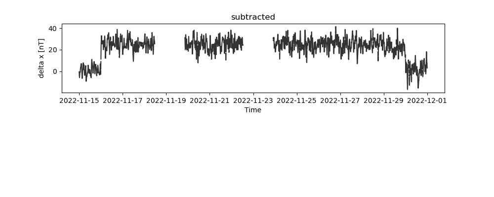. If you specify keys using option 
i.e. keys=['x'] only these data specific keys will remain. You might want to use diff.get_gaps() to fill np.nans into 
missing time steps. 

#### 5.10.4 append

The append method is applying the `join_streams` method to a list of streams. This is useful if you have many 
individual data sets and want to combine them.

        long_stream = append_streams([list,with,many,streams])

#### 5.10.5 determine_time_shift

The method 'determine_time_shift' allows for determining phase shifts between to input signale. The shift can be 
obtained by two two different methods. Cross correlation based on scipy.signal.correlate is used when selecting method 
*'correlate'*. More efficient on large data sets is the method 'fft'. Assume you have two shifted signals as shown in 
Figure 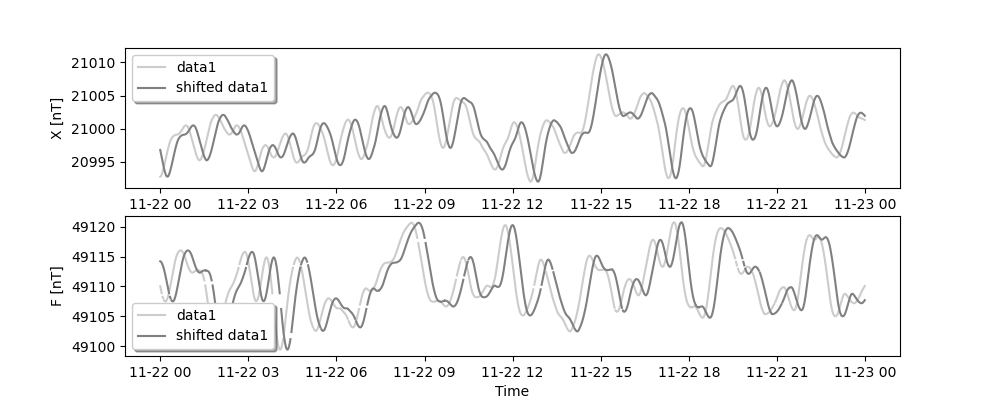. 
The obtained shift will give you the amount of second to shift data2 in order to obtain data1. Apply time shift 
calculations result in

         print ("(Correlate) Time shift in seconds: {}".format(determine_time_shift(data1,shifted_data1, method='correlate', col2compare='f')))
         print ("(FFT) Time shift in seconds: {}".format(determine_time_shift(data1,shifted_data1, method='fft', col2compare='f')))

         (Correlate) Time shift in seconds: -898.8000000000001
         (FFT) Time shift in seconds: -896.4

         Expected value: -900 sec

### 5.12 All methods at a glance

For a summary of all supported methods, see the section **List of all MagPy methods** below.

class  |  method  |  variables  |  description
-----  |  ------  |  ---------  |  -----------
**stream**  |    |    |  
DataStream  |  _aic  |  self, signal, k, debugmode=None  |  determines Akaki Information Criterion for a specific index k
DataStream  |  _convertstream  |  self, coordinate, **kwargs  |  Convert coordinates of x,y,z columns in stream
DataStream  |  _copy_column  |  self, key, put2key  |  copy one column to another key
DataStream  |  _det_trange  |  self, period  |  starting with coefficients above 1%
DataStream  |  _drop_column  |  self, key  |  drop contents of a column from a stream
DataStream  |  _get_column  |  self, key  |  Helper to drop lines with NaNs in any of the selected keys
DataStream  |  _get_key_headers  |  self  |  return times of first and last stream data points
DataStream  |  _get_key_names  |  self, key  |  returns a numpy array of selected columns from Stream
DataStream  |  _get_max  |  self,**kwargs  |  Returns keys in datastream
DataStream  |  _get_min  |  self, key, returntime=False  |  returns float
DataStream  |  _get_variance  |  self, key, returntime=False  |  returns float
DataStream  |  _move_column  |  self, key, put2key  |  moves one column to another key
DataStream  |  _print_key_headers  |  self  |  Prints keys in datastream with variable and unit
DataStream  |  _put_column  |  self, column, key, columnname, columnunit  |  adds a column to a Stream
DataStream  |  _remove_nancolumns  |    |  
DataStream  |  _select_keys  |    |  
DataStream  |  _select_timerange  |  self, start, end  |  
DataStream  |  _tau  |  self, period  |  low pass filter with
DataStream  |  add  |  self, datlst)  |  
DataStream  |  aic_calc  |  self, key, **kwargs  |  returns stream
DataStream  |  amplitude  |    |  
DataStream  |  baseline  |  self, absolutestream, **kwargs  |  calculates baseline correction for input stream
DataStream  |  bc  |  self, ??, **kwargs  |  applies baseline correction based on header information
DataStream  |  calc_f  |  self, **kwargs  |  
DataStream  |  compensation  |  self,**kwargs  |  applies compensation field values from header to x,y,z
DataStream  |  cut  |  self,length,kind=0,order=0  |  
DataStream  |  dailymeans  |  self  |  for DI stream
DataStream  |  delta_f  |  self, **kwargs  |  Calculates the difference of x+y+z to f
DataStream  |  determine_rotationangles  |    |  
DataStream  |  dict2stream  |    |  
DataStream  |  differentiate  |  self, **kwargs  |  returns stream
DataStream  |  dropempty  |    |  
DataStream  |  dwt_calc  |  self,key='x',wavelet='db4',level=3,plot=False,outfile=None, window=5  |  helper method for storm detection
DataStream  |  end  |  self  |  return endtime
DataStream  |  extend  |  self,datlst,header  |  Extends stream object
DataStream  |  extract  |  self, key, value, compare=None, debugmode=None  |  
DataStream  |  extract_headerlist  |  self, element, parameter=1, year=None  |  
DataStream  |  extrapolate  |  self, start, end  |  read absolute stream and extrapolate the data
DataStream  |  filter  |  self, **kwargs  |  returns filtered stream
DataStream  |  fillempty  |    |  
DataStream  |  findtime  |  self,time  |  returns index of given time
DataStream  |  fit  |  self, keys, **kwargs  |  returns fitting function
DataStream  |  func2header  |    |  
DataStream  |  func2stream  |    |  
DataStream  |  get_fmi_array  |  self, missing_data=None, debug=False  |  helper method for K_fmi determination
DataStream  |  get_gaps  |  self, **kwargs  |  determines gaps in time axis and fills them with NaN
DataStream  |  get_key_name  |    |  
DataStream  |  get_key_unit  |    |  
DataStream  |  get_sampling_period  |  self  |  sampling perid in seconds
DataStream  |  harmfit  |    |  
DataStream  |  hdz2xyz  |    |  
DataStream  |  idf2xyz  |    |  
DataStream  |  integrate  |  self, **kwargs  |  returns stream
DataStream  |  interpol  |  self, keys, **kwargs  |  returns interpolation function
DataStream  |  interpolate_nans  |    |  
DataStream  |  mean  |  self, key, **kwargs  |  Calculates mean values for the specified key, Nan's are regarded for
DataStream  |  modwt_calc  |  self,key='x',wavelet='haar',level=1,plot=False,outfile=None,window=5  |  helper method for storm detection
DataStream  |  multiply  |  self, factors  |  
DataStream  |  offset  |  self, offsets  |  Apply constant offsets to elements of the datastream
DataStream  |  randomdrop  |  self, percentage=None, fixed_indicies=None  |  
DataStream  |  remove  |  self, starttime=starttime, endtime=endtime  |  
DataStream  |  resample  |  self, keys, **kwargs  |  Resample stream to given sampling period
DataStream  |  rotation  |  self,**kwargs  |  Rotation matrix for rotating x,y,z to new coordinate system xs,ys,zs
DataStream  |  samplingrate  |  self, **kwargs  |  sampling period in seconds, rounded
DataStream  |  simplebasevalue2stream  |    |  
DataStream  |  smooth  |  self, keys, **kwargs  |  smooth the data using a window with requested size
DataStream  |  sorting  |  self  |  Sorts object
DataStream  |  start  |  self  |  return starttime
DataStream  |  steadyrise  |    |  
DataStream  |  stream2dict  |  self,dictkey='DataBaseValues'  |  
DataStream  |  trim  |  self, starttime=None, endtime=None, newway=False  |  returns stream within new time frame
DataStream  |  use_sectime  |  self  |  Swap between primary and secondary time (if sectime is available)
DataStream  |  write  |  self, filepath, **kwargs  |  Writing Stream to a file
DataStream  |  xyz2hdz  |    |  
DataStream  |  xyz2idf  |    |  
  |  determine_time_shift  |    |  find time shift between two streams
  |  join_streams  |    |  join all contents from provided streams including length extension
  |  merge_streams  |    |  merge contents from different streams, eventually fill gaps with data of subsequent streams
  |  subtract_streams  |    |  differences of two stream

## 6. Annotating data and flagging

Geomagnetic raw data (and also data from all other disciplines) contains numerous signals of different natural and 
artificial sources, affecting various different frequency bands. These signals can generally be divided into two 
subgroups. Group 1 comprises all disturbing signals of mainly anthropogenic origin which are not considered for 
definitive data production. Such disturbing signals are typically removed before final data production. The basic 
treatment as well as the definition of such disturbances is not uniform. Some disturbances depend strongly on site 
location and  environment. 
Group 2 consist of mainly natural signals, which are not removed for definitive data production. Among these signals 
are  long and short term variations of which especially some short term variations are sometimes not easily 
distinguishable from group 1 disturbances. Ideally such data is flagged/labelled , which however is not performed 
very often in geomagnetic data analysis.

Hereinafter we will follow the same way as originally suggested as part of the MagPy software. We will label (flag) 
data in dependency of the observed signal. Signals will be assigned to either "suitable for definitive data" or 
"not suitable for definitive data". MagPy 2.x will use flagtypes, an integer value, to describe this assignment.
Flagtype 1 and 3 will be used for signals to be removed, flagtype 1 for automatically identified signals, flagtype 3
for signals marked and labeled by an observer. Flagtype 2 and 4 are used for signals to be kept, 2 automatically 
identified by i.e. SSC detector, flagtype 4 for manually assigned markings. Flagtype 0 is used for labeled data without 
verified assignment to any of the types above. Such data will be kept for analysis. 
Each flagtype can contain various different individual labels. These labels will be characterized by a unique label 
identifier and a human readable description of the label. The following table contains an overview of the labels 
currently included in MagPy. Please note that additional labels can be easily incorporated into the processing scheme. 
Some details on specific labels are discussed later in this manual. 

FlagID   |  Description | LabelGroup
-------- | -------- | -------- 
000 | normal | 0
001 | lightning strike | 1
002 | spike | 1
012 | pulsation pc 2 | 2
013 | pulsation pc 3 | 2
014 | pulsation pc 4 | 2 
015 | pulsation pc 5 | 2
016 | pulsation pi 2 | 2
020 | ssc geomagnetic storm | 2
021 | geomagnetic storm |  2
022 | crochete | 2
030 | earthquake | 1
050 | vehicle passing above | 1
051 | nearby disturbing source | 1
052 | train | 1
090 | unknown disturbance |  1

LabelGroups: 0 - normal data, 1 - disturbance to be removed, 2 - signal to be kept

Marking or labelling certain signals within data sets is supported since the first versions of MagPy. MagPy2.x comes
with a number of reorganizations and new functions to assist the observers. In section 6.1 we will firstly give you 
some instructions to some underlying routines of the new flagging module. Then, starting in section 6.2, we will 
focus on flagging methods which can be directly applied to data sets in order to obtain specific information on 
contained signals.

## 6.1 Basics of the flagging module

Data flagging is handled by magpy.core.flagging module.

        from magpy.core import flagging

After importing this functionality we create an empty flagging object

        fl = flagging.flags()

This flagging object corresponds to a python dictionary consisting of a unique identifier as key and flagging contents
as value. Flagging contents are subject to the following fields: obligatory are 'sensorid', 'starttime', 'endtime', 
'components', 'flagtype' and 'labelid'. Optional fields are 'label', 'comment', 'groups', 'probabilities' 'stationid', 
'validity', 'operator', 'color'. Automatically filled are fields 'modificationtime' and 'flagversion'. The unique 
identifier is constructed from the obligatory fields. 

Add flags to this object

        fl = fl.add(sensorid="LEMI025_X56878_0002_0001", starttime="2022-11-22T16:36:12.654362",
                    endtime="2022-11-22T16:41:12.654362", components=['x', 'y', 'z'], labelid='020', flagtype=4,
                    comment="SSC with an amplitude of 40 nT", operator='John Doe')
        fl = fl.add(sensorid="GSM90_Y1112_0001", starttime="2022-11-22T10:56:12.654362",
                          endtime="2022-11-22T10:59:12.654362", components=['f'], flagtype=3, labelid='050')
        fl = fl.add(sensorid="GSM90_Y1112_0001", starttime="2022-11-22T10:58:12.654362",
                          endtime="2022-11-22T11:09:45.654362", components=['f'], flagtype=3, labelid='050')
        fl = fl.add(sensorid="LEMI025_X56878_0002_0001", starttime="2022-11-22T20:59:13.0",
                    endtime="2022-11-22T20:59:14.0", components=['x', 'y', 'z'], labelid='001', flagtype=3,
                    operator='John Doe')

You can get a formated output of the flagging contents by 

        fl.fprint(sensorid="LEMI025_X56878_0002_0001")

You might want to limit the output to specific sensor IDs by providing the Sensor ID as option. If you want to modify 
flags and keep the original state in the memory use the copy method

        orgfl = fl.copy()

A number of methods are available for modifying and extracting flagging information. You can extract specific
information for any content (field):

        lightningfl = fl.select('comment', ['lightning'])

You can also select a specific time range by using the trim method

        timefl = fl.trim(starttime='2022-11-22T09:00:00', endtime='2022-11-22T11:00:00')

Combination of different flagging objects is possible as follows

        comb = timefl.join(lightningfl)

Sometime you are interested in the differences of two flagging objects

        diff = comb.diff(fl)

Flags defined by a parameter (field) and searchterms for this parameter can be dropped from the flagging object

        newfl = fl.drop(parameter='sensorid', values=['GSM90_Y1112_0001'])

Specific contents associated to a given field can be replaced 

        flmodified = fl.replace('stationid', '', 'WIC')

Time ranges of overlapping flags can be combined using the `union` method. Hereby the option level defines the required 
grad of similarity with level=0 being the most stringent criteria - only combine if identical fields are found. 
Providing a sampling period of the underlying data set will also combine consecutive flags within a sampling rate
time difference. 

        combfl = fl.union(samplingrate=1, level=0)

Sometimes automatically determined flags (i.e. outliers), need to be renamed in dependency of an observers decision. 
I.e. a lot of lightning strike have been marked as "spikes" by an automatic routine. The observer identifies these 
spikes to be of lightning origin. The observer can now just assign a single lightning flag and then run the 
`rename_nearby` method to change any automatic flags within a given timerange (default is one hour):

        renamedfl = fl.rename_nearby(parameter='labelid', values=['001'])

Finally, if you would like to obtain some general information on contents of your flagging object or just the overall 
coverage you can use the following methods. The `stats` method comes with an "level" option, for more detailed 
information, default is level=0.

        mintime, maxtime = fl.timerange()

        fl.stats(level=1)

### 6.2 Identifying spikes in data sets

Spikes are identified by a well known and commonly used technique for outlier detection. By running window of defined 
timerange across the sequence we determine the inner quartile range IQR for the sequence. Any datapoint exceeding
the IQR by a given multiplier as defined in *threshold* will be termed "outlier". 

Import the necessary modules:

        from magpy.stream import *
        from magpy.core import plot as mp
        from magpy.core import flagging

Load a data record with data spikes:

        datawithspikes = read(example1)

Lets trim the dataset to a disturbed sequence for better visibility

        datawithspikes = datawithspikes.trim(starttime="2018-08-02T14:30:00",endtime="2018-08-02T15:30:00")

Mark all spikes using the automated function `flag_outlier` and return a flagging object. We define a timerange of 
60 seconds and a threshold commonly applied for IQR techniques. The *markall* option defines that a data flagged in
any component will also create a flag in all other components as we assume that the full vector is affected:

        fl = flagging.flag_outlier(datawithspikes, timerange=60, threshold=1.5, markall=True)

Drop flagged data from the "disturbed" data set.

        datawithoutspikes = fl.apply_flags(datawithspikes, mode='drop')

Show original data in red and cleand data in grey in a single plot:

        mp.tsplot([datawithspikes,datawithoutspikes],['x','y','z'], symbolcolors=['r','grey'])

This results in Figure 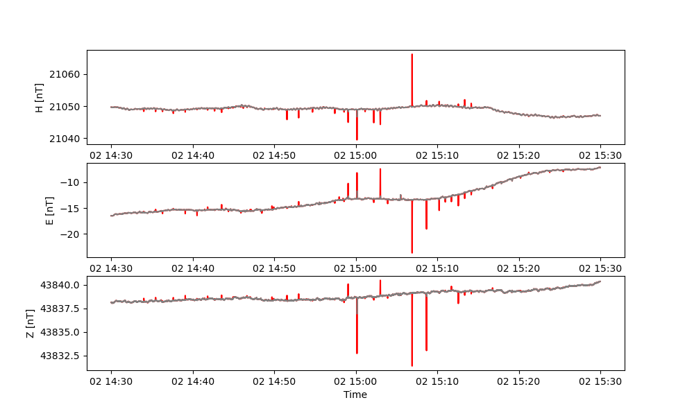

### 6.3 Flagging ranges

You can flag ranges either in time or value by using the `flag_range` method.
Import the necessary modules:

        from magpy.stream import *
        from magpy.core import plot as mp
        from magpy.core import flagging

Then load a data record and firstly add a flagging range in time.

        data = read(example1)

        timefl = flagging.flag_range(data, keys=['x'], 
                                     starttime='2018-08-02T14:30:00', 
                                     endtime='2018-08-02T15:15:00', 
                                     flagtype=3, 
                                     labelid='051', 
                                     text="iron maiden dancing near sensor",
                                     operator="Max Mustermann")

We also will flag values exceeding a given threshold in the same data set:

        valuefl = flagging.flag_range(data, keys=['x'], 
                                  above=21067,
                                  flagtype=0,
                                  labelid='000',
                                  text="interesting values for later discussion",
                                  operator="Mimi Musterfrau")

For displaying put these flags together using the `join`method:

        fl = valuefl.join(timefl)

Create graphical patches for displaying this flagging information:

        p = fl.create_patch()

Show flagged data in a plot:

        fig, ax = mp.tsplot(data,['x'],patch=p, height=2)

This results in the following plot 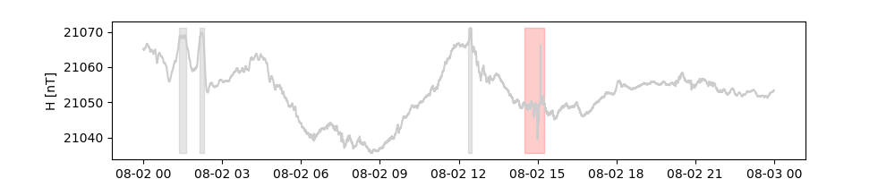

### 6.4 Flagging binary states 

You can flag data based on binary states. This method can be used i.e. to flag data if a certain switch, stored
as binary state in some data column, is turned on.

Import the necessary modules:

        from magpy.stream import *
        from magpy.core import plot as mp
        from magpy.core import flagging

Then load a data record:

        data = read(example1)

Add some artificial binary data i.e. a light switch

        var1 = [0]*len(data)
        var1[43200:50400] = [1]*7200
        data = data._put_column(np.asarray(var1), 'var1')

Flag column x based on the switching state of column var1. By default status changes are flagged.
The option *markallon* will additionally mark the full time range containing 1 in var1.

        fl = flagging.flag_binary(data, key='var1', keystoflag=["x"],
                                     flagtype=3, 
                                     text="light switch affecting signal",
                                     markallon=True)

Create graphical patches for displaying this flagging information:

        p = fl.create_patch()

Show flagged data in a plot:

        fig, ax = mp.tsplot(data,['x'],patch=p, height=2)

It is also possible to plot flags without any linkage to a data file. For this purpose you need to supply an empty
DataStream and then activate the force option of tsplot:

        fig, ax = mp.tsplot(DataStream(), patch=p, height=2, force=True)

TODO: add some words on annotation here
Result: 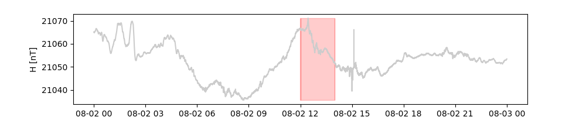

### 6.5 Converting data sets to flagging information

This example covers two subjects: Firstly we will convert a data stream into flagging information. Secondly we will 
apply flags defined for one data set to another one.
By default any flagging information is directly related to the sensor information of the instrument on which 
flagging has been performed. Sometimes however it is necessary to apply flags identified in one data set on data 
from another independent data set. A typical example would be the quake information as follows. 

Import the necessary modules:

        from magpy.stream import *
        from magpy.core import plot as mp
        from magpy.core import flagging

Lets load some data from a suspended magnetometer. Such data might be affected by nearby earthquakes

        yesterday = datetime.now() - timedelta(1)
        today = datetime.now()
        data = read("https://cobs.zamg.ac.at/gsa/webservice/query.php?id=WIC&starttime={}&endtime={}".format(yesterday.date(),today.date()))
        print ("Got {} data points for data set with sensorid {}".format(len(data),data.header.get('SensorID')))

Get a timeseries of some recent earthquakes

        quake = read('https://earthquake.usgs.gov/earthquakes/feed/v1.0/summary/4.5_week.csv')

Here you might want to filter the earthquake data and select only nearby shakes. This is described elsewhere. Now we 
just plot everything for the day covered by our data set. Trim the earthquake information to the same timerange as the 
data set:

        quake = quake.trim(starttime="{}".format(yesterday.date()),endtime="{}".format(today.date()))
        print ("Found {} earthquakes".format(len(quake)))

Transform quake data to a flagging object. Please note that we assign this flagging information to a group of 
instruments. Groups can look like "{'magnetism':['x','y','z','f'], 'gravity':['x'], 'RADONSGO_1234_0001':['x']}" and thus
consist of SensorGroup or SensorID inputs from the data stream header plus the potentially affected keys by the flag.
The here selected group contains xyz keys of the suspended variometer data set imported above.

        fl = flagging.convert_to_flags(quake, flagtype=2, labelid='030', commentkeys=['M','f',' - ','str3'], groups={data.header.get('SensorID'):['x','y','z']})

Lets get a formated output of the flagging contents

        fl.fprint(sensorid=quake.header.get('SensorID'))

Then create some patches for the variometer data 

        p = fl.create_patch(data)

Show flagged data in a plot:

        fig, ax = mp.tsplot(data, ['x'], patch=p, height=2)

Result: 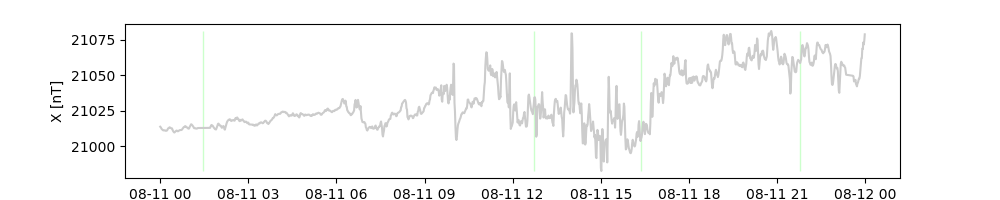

### 6.6 Saving and loading flagging data

Firstly we will import some necessary modules:

        from magpy.stream import *
        from magpy.core import flagging

#### 6.6.1 Saving flagging objects

Lets create a small flagging object

        fl = flagging.flags()
        fl = fl.add(sensorid="LEMI025_X56878_0002_0001", starttime="2022-11-22T16:36:12.654362",
                    endtime="2022-11-22T16:41:12.654362", components=['x', 'y', 'z'], labelid='020', flagtype=4,
                    comment="SSC with an amplitude of 40 nT", operator='John Doe')
        fl = fl.add(sensorid="GSM90_Y1112_0001", starttime="2022-11-22T10:56:12.654362",
                          endtime="2022-11-22T10:59:12.654362", components=['f'], flagtype=3, labelid='050')

You can save this object to a file using the following commend. The recommended file format corresponds to a json
object, an ideal type for dictionary like structure and readable as plain text. In MagPy2.x only "json" is supported.

        fl.save("/tmp/myflags.json")

By default any new data is appended to an existing file. In order to overwrite the file you specifically need to 
supply option "overwrite=True".

#### 6.6.2 Loading flagging objects

In order to load flagging data use the `load` method of the flagging module

        fl = flagging.load("/tmp/myflags.json")

The `load` method is fully compatible with earlier versions of MagPy. Any earlier flagging data however does not have
fields like "groups", "operator" and many others. You might want to fill these fields and store the data again. You
cannot append flagging data to files containing earlier flagging versions. 

        data = read(example1)
        fl = flagging.load("/tmp/myoldflags.json")
        ndata = fl.apply_flags(data)

#### 6.6.3 Saving data with incorporated flagging information

We strongly recommend to keep flagging information and data separately. Nevertheless, and as typically used in earlier
MagPy versions, it is still possible to save data together with the list of flags to a CDF file. Lets do that for
example1 and its outliers:

        data = read(example1)
        fl = flagging.flag_outlier(data, timerange=120, threshold=3, markall=True)

Now we need to apply the flagging object to the data and insert flagging information directly into the data stream

        dataiwithflags = fl.apply_flags(data, mode='insert')

And then we can save this data set with flagging data included as CDF. Please note that only CDF export types support
flagging contents

        dataiwithflags.write('/tmp/',filenamebegins='MyFlaggedExample_', format_type='PYCDF')

Extracting such incorporated flagging information is currently not possible in MagPy 2.0.

### 6.7 Advanced flagging methods and *flag_bot*

#### 6.7.1 Preparing data for AI - flag_ultra

Identifying signals is a matter of significance and significance is typically defined by some threshold. Based on these 
prerequisites it is rather simple to apply artificial intelligence (AI) for analysis support. We only need to 
create a training and a test data set which is defined by raw data files associated by its manually determined optimal 
labeling information. When making use of the MagPy software the applicant only needs to defined a label table and 
use MagPy's flagging routines to create this information.

In the following approach we are (A) identifying "non-normal" signals and then (B), based on characteristics of this 
signal, assign a label. 
Identification (A) is solely based on a simple threshold definition making use of quartile analysis of time ranges. 
Parts of the sequence exceeding the value level by a given multiple of quartile ranges are termed to be suspicious 
data. These multipliers are different for each instrument and observatory (even for each component) and should be 
chosen so that data is automatically selected which  would also be selected by the observer.
When suspicious data has been marked, (B) flag_bot can be used to obtain best fitting labels for these sequences. 
In a productive environment both steps can be performed fully automatically, thus providing a fully flagged data set 
to the observer for final verification. 

Assigning flag labels without AI can be done by the flag_ultra probability technique. This is only useful for 
testing purposes.  

TODO - Import modules:

        from magpy.stream import *
        from magpy.core import plot as mp
        from magpy.core import flagging

        data = read(example1)
        fl = flag_ultra(data)

        cleandata = fl.apply_flags(data, mode='drop')

Show original data in red and cleand data in grey in a single plot:

        mp.tsplot([data,cleandata],['x','y','z'], symbolcolors=['r','grey'])

## 7. DI-flux measurements, basevalues and baselines

The first sections will give you a quick overview about the application of methods related to DI-Flux analysis, 
determination und usage of baseline values (basevalues), and adopted baselines. The theoretical background and 
details on these application are found in section 7.7. Methods and classes for basevalue DI analysis are
contained in the `absolutes` module:

        from magpy import absolutes as di

For the examples and instructions below we will import a few additional modules and methods:

        from magpy.stream import example6a, example5, DataStream, read
        from magpy.core.methods import *

Before continuing a few comments on wording as used in the following:

+ **DI measurement/absolute data** : individual values of a typical 4-lagen declination (D) and inclination (I) measurement 
using a non-magnetic theodolite. DI measurements will provide absolute values D(abs) and I(abs)

+ **reference pier (Pref)** : the main pier in your observatory at which DI measurements are performed

+ **alternative pier (P(alt)** : any other pier where once in a while DI measurements are performed

+ **pier deltaD,deltaI and deltaF (pdD, pdI, pdF)** : differences between P(ref) and P(alt) which can be applied to P(alt) data, so that 
baseline corrected results using P(alt) data correspond to BCR of P(ref)

+ **deltaF (dF)** : the difference in F between a continuously measuring scalar sensor and the reference pier (P(ref))

+ **F absolute F(abs)** : the absolute F value measured directly at P(ref) at the same height as D And I 

+ **F continuous F(ext)** :  F value from a continuous measurement. F(ext) + dF = F(abs)

+ **basevalues** : delta values obtained fro each DI analysis which describe the momentary difference between a 
continuously measuring systems and the DI determination. MagPy determines basevalues either in cylindrical 
(dH, dD, dZ, dF, default, dH is delta of horizontal component) or cartesian (dX, dY, dZ, dF) coordinates.

+ **baseline/adopted baseline** : a best fit of any kind (linear, spline, polynomial , step function) to multiple basevalues.

+ **baseline correction** : applying baseline functions to continuously measured data so that this data describes "absolute"
field variations

### 7.1 Reading and analyzing DI data

In this section we will describe in detail how a DI analysis is preformed and which methods are implemented. For 
productive data analysis, however, there is a single method implemented, which comprises all of the following
procedures. Please move to section 7.2 for a description of the productive method.

Lets first import the required modules for DI/absolute analysis and some example files and helper methods:

        import magpy.absolutes as di
        from magpy.stream import read, DataStream(), example6a, example5
        from magpy.core.methods import *

#### 7.1.1 Data structure of DI measurements

Please check `example6a` or  `example6b` , which are example DI files. You can create these DI files by using the 
input sheet from xmagpy or the online input sheet provided by the Conrad Observatory. If you want to use this service, 
please contact the Observatory staff. Also supported are DI-files from the AUTODIF. MagPy will automatically 
recognize a number of DI data formats while loading. Use the the following method to load a single or multiple
DI data sets:

        abslist = di.abs_read(example6a)  # should be the default

You might want to view the data in a formated way

        for ab in abslist:
            l1 = ab.get_data_list()
            print (l1)

For our analysis we will extract data from the loaded *abslist* and convert to into an DI analysis structure. 

        absdata = ab.get_abs_distruct()

#### 7.1.2 Adding data from continuously measuring instruments 

DI is used to calculate basevalues for specific instruments. The above defined DI-structure allows to add variometer
and scalar information to it. Let us assume you have variometer data from an HEZ 
oriented system (this is the expected default). You can just load this data using the magpy stream standard read 
method. 

        variodata = read(example5)

You might want to drop flagged data and perform some conversions. Please check the appropriate sections for data 
manipulation if necessary. If you do not know (actually you should) if the loaded variometer data (variodata) covers 
the timerange of the DI measurement (absdata) then you can use the following helper method. 

        vario_rangetest = absdata._check_coverage(variodata,keys=['x','y','z'])

Please note: the variometers H E and Z data is stored at the data keys x, y, z. Do not mix up data keys
used for naming predefined columns and data values associated with these keys.
As variometer data might not contain individual measurements exactly at the same time as DI measurements were performed
i.e. in case of one-minute variometer data, the variometer data is linearly interpolated and variation data
at times of DI  measurements are extracted at the DI timesteps. Please note: if variation data contains exactly the
timesteps of DI data then exactly the truly measured variation signals are used as linear interpolation only affects
time ranges inbetween variometer data points.  Variation data is then inserted into the absdata structure

        if vario_rangetest:
            func = variodata.interpol(['x','y','z'])
            absdata = absdata._insert_function_values(func)

The same procedure can also be performed for independently measured scalar (F) data. 

        scalardata = read(example5)
        scalar_rangetest = absdata._check_coverage(variodata,keys=['f'])
        if scalar_rangetest:
            func = scalardata.interpol(['f'])
            absdata = absdata._insert_function_values(func)

In case your F data is contained in exactly the same file as variometer data, as it is the case for our example you 
just might add the 'f' key to interpolation and coverage test `func = variodata.interpol(['x','y','z','f'])`

There is also a helper method included in MagPy2.x which is of particular interest if you are using meta information
and database features of MagPy, particularly when it comes to flagging, pier differences in D, I and F as well
as transformations (fluxgate compensation, rotations). The following method is included in the absolute_analysis main 
method and will apply projected options. Source data from database and files is supported. Some details are discussed
in section 7.2.

       data = data_for_di({'file':example5}, starttime='2018-08-29',endtime='2018-08-30', datatype='both', debug=True)
       valuetest = absdata._check_coverage(data,keys=['x','y','z','f'])
       if valuetest:
           func = data.header.get('DataFunctionObject')[0]
           absdata = absdata._insert_function_values(func)

#### 7.1.3 Considering F differences between reference pier and continuous measurement position

#### 7.1.4 Considering pier differences for non-reference pier measurements

If you perform DI measurements on multiple piers you might want to consider the pier differences in respect
respect to a reference pier. This pier  differences can either be provided directly or can be organized in 
a MagPy data base on a yearly basis.
You reference pier P1 is used for the majority of your DI measurements. Once in a while you perform measurements 
on pier P2. From these measurements you determined an average difference of deltaD = 0.001 deg, deltaI = 0.002 deg 
and deltaF = -0.23 nT for 2023. For your ongoing P2 analysis you consider these delta values by supplying them
to the calcabsolute method. You can also organize these values in a MagPy database (PIERS table) and 

       from magpy.core import database
       from datetime import datetime

       db = database.DataBank("localhost","maxmustermann","geheim","testdb")
       pdD = None
       starttime = datetime.utcnow()
       if not pdD:
           pdI = db.get_pier('A7', 'A2', value='deltaI', year=starttime.year)

#### 7.1.5 Analyzing DI data

After reading DI data and associating continuous measurements to its time steps it is now time to determine the 
absolute values of D and I, and eventually F if not already measured at the main DI pier. DI analysis makes use of a 
stepwise algorythm based on an excel sheet by J. Matzka and DTU Copenhagen (see section 7.7 for background information). 
This stepwise procedure is automatically performed by the the `calcabsolutes`method, which will iteratively call the 
submethods _calddec and calcinc.

       result = absdata.calcabsolutes(usestep=0, annualmeans=None, printresults=True, 
                              deltaD=0.0, deltaI=0.0, meantime=False, scalevalue=None, 
                              variometerorientation='hez', residualsign=1)

As option *printresult* is selected this will result in the following output. The variable *result* will contain all 
analysis data reduced to the time of the first measurement. If you want to use the mean time of the measurements
active option *meantime=True*. You can also supply *annualmeans* which will be used in case no F(abs) and no F(ext) 
is available. *residualsign* of either +1 or -1 is related to the orientation of the fluxgate probe on the theodolite
where +1 denotes an inline-orientation. Finally, *usestep* defines the measurement to be used. Currently MagPy 
DI analysis supports up to two repeated measurement for each position. You can analyse the first one *usestep=1* or the 
second *usestep=2* or the average of both with *uesestep=0*.

The output looks as follows:

      $ Vector at: 2018-08-29 07:42:00+00:00
      $ Declination: 4:20:36, Inclination: 64:22:14, H: 21031.8, Z: 43838.8, F: 48622.8
      $ Collimation and Offset:
      $ Declination:    S0: 4.941, delta H: 2.345, epsilon Z: 57.526
      $ Inclination:    S0: 5.233, epsilon Z: 58.010
      $ Scalevalue: 1.003 deg/unit

If you want to see what `calcabsolute`is actually doing you can perform the iterative procedure yourself. 
Just call the submethods `_calddec` and `_calcinc` and gradually improve determinations of D, I and basevalues. 
You just need to provide some starting values and then call the following methods. Results from a previous step are 
fed into the next step. Here we are using three steps and you can see, that the results already stabilizes after the 
second step. This example is part of the jupyter notebook manual. 

### 7.2 The absolute_analysis method - single command DI analysis 

Basically everything necessary for DI analysis as shown in 7.1 is available with a single command `absolute_analysis`.

Besides all the methods shown above, the absolut analysis command also makes use of two additional
helper methods `absolutes._analyse_di_source` and `methods.data_for_di`. The first one allows you
to access DI raw data from various different sources. Details will be discussed below.
The second method `data_for_di` is used by absolute_analysis to read continuous variometer and scalar data for (a) 
calculations of absolute declination, inclination and F at a single point of time (i.e. first measurement)
and (b) to determine the basevalues for variometer and scalar sensor for this point in time.
Both data sets eventually need to be corrected. Variometer data eventually needs bias/compensation fields
applied, rotations might be used to transform into either HEZ or XYZ coordinate systems. Scalar data might
corrected for delta F, the difference between continuous measurement position and DI pier. Finally,
timeshifts can be applied to both data sets.

The application `absolute_analysis` comes with a hugh number of options in order to make full use of all possibilities 
by the methods listed above and section 7.1. The most important will be discussed here. Checkout 
`help(di.absolute_analysis)` for all options. The analytical procedures are outlined in detail in 
section 7.7. 

The most basic application for di ananlysis is as follows:

        diresult = di.absolute_analysis('/path/to/DI/','path/to/vario/','path/to/scalar/')

Path to DI can either point to a single file, a directory or even use wildcards to select data from a specific 
observatory/pillar. Using the examples provided along with MagPy, an analysis can be performed as follows. 

       diresult = di.absolute_analysis(example6a, example5, example5)

Calling this method will provide terminal output as shown above in 7.1 and a stream object `diresult` which can be 
used for further analyses.

Fext indicates that F values have been used from a separate file and not provided along with DI data. Delta values
for F, D, and I have not been provided either. `diresult` is a stream object containing average D, I and F values, 
the collimation angles, scale factors and the base values for the selected variometer, beside some additional meta 
information provided in the data input form.

Variometer and Scalar data can be obtained from files, directories, databases and webservices. The same applies for 
data sources for th DI data. You might even want to define i.e. both a database source and a file archive. In this 
case first the database will be searched for valid data and if not found than the file path will be used

In the following some examples for different data sources are shown:

       from magpy.core import database
       db = database.DataBank("localhost","maxmustermann","geheim","testdb")
       basevalues = absolute_analysis(example6a, {'file':example5, 'db':(db,'WIC_1_0001_0001')}, example5, db=db, starttime="2018-08-28", endtime="2018-08-30")
       basevalues = absolute_analysis([example6a,example6b], {'file':example5, 'db':(db,'WIC_1_0001_0001')}, example5, db=db, starttime="2018-08-28", endtime="2018-08-30")
       basevalues = absolute_analysis('DIDATA', {'file':example5, 'db':(db,'WIC_1_0001_0001')}, example5, db=db, starttime="2018-08-28", endtime="2018-08-30")

The following options are available to provide DI data:
 - database       : 'tablename' ; requires options db, starttime and endtime, recommended option pier (if you use more then one)
                                  i.e. db=database.DataBank("localhost","user","pwd","dbname"), starttime=
 - individual file  : "/path/to/file1.txt"
 - multiple files : ["/path/to/file1.txt","/path/to/file2.txt"]
 - directory      : "/directory/with/difiles/"; requires options starttime and endtime, option diid recommended
 - webservice     : TODO ;requires options starttime and endtime,

Depending on the DI data source it migth also be necessary to provide the following options, if this information 
is not part of the header (i.e. AutoDIF data, webservices): startionid, pier, azimuth

The following options are available to provide variometer and scalar data:
 - database                : {"db":(db,"tablename")}
 - individual file           : "/path/to/data.cdf" or {"file":"/path/to/data.cdf"}
 - directory with wildcards : "/path/with/data/*" or "/path/with/data/*.cdf" or {"file":"/path/to/data/*"}
 - webservice              : "https://cobs.geosphere.at/gsa/webservice/query.php?id=WIC" or {"file": ...}

In the following a few options are discussed. This is only the tip of the iceberg. If you want to get information about
all options please use help(di.absolute_analysis).

All options correspond to the similar named options in all other di methods as listed in 7.1. The probably most
important are 
Basic parameters: variometerorientation (XYZ or HEZ analysis)
Corrections: alpha, beta, deltaF, deltaD, deltaI, compensation, magrotation; 
Residual method: residualsign
Thresholds: expD, expI, expT
Archiving successful analysis: movetoarchive and dbadd; TODO code needs to be written and tested  

       basevalues = absolute_analysis('DIDATA', {'file':example5, 'db':(db,'WIC_1_0001_0001')}, example5, db=db, starttime="2018-08-28", endtime="2018-08-30", movetoarchive="/home/leon/Tmp/")
       basevalues = absolute_analysis("/home/leon/Tmp/2018-08-29_07-42-00_A2_WIC.txt", {'file':example5, 'db':(db,'WIC_1_0001_0001')}, example5, db=db, starttime="2018-08-28", endtime="2018-08-30", movetoarchive="/tmp")
       basevalues = absolute_analysis(example6b, example5, example5, db=db, dbadd='DIDATA', stationid='WIC')

A typical command as used in the Conrad Observatories automatically scheduled analysis routine looks as follows. 
Manual data, as typed in using the xmagpy form, and automatic AutoDIF measurements are collected by a script within 
an analysis directory. The successfully analzed data sets are stored in a database and files are moved/stored in an 
archive - raw -directory. Failed analyses will remain within the analysis directory for review by the observer.

TODO : F(abs) and F(ext) - examples 

### 7.3 Dealing with INTERMAGNET IBFV files

Please check out section 3.4.4 for details on the read process for INTERMAGNET IBFV files. Basevalue data is stored 
internally like any other timeseries datastream object. Please remember that such data sets unlike other timeseries
objects are not evenly spaced. Consider for any ongoing analyses. MagPy allows you to incorporate much more information
into such basevalue data sets as possible in IBFV structures. Among these additional data are collimation angles,
information on observer and instruments etc. Therefore it is recommended to use one of MagPy's internal data formats to
save basevalue data as obtained in sections 7.1 and 7.2. IBFV files can then be easily created for final publication. 

### 7.4 Basevalues and baselines

Basevalues as obtained section 7.2 are stored in a normal data stream object, therefore all analysis methods outlined
above can be applied to this data. The `diresult` object contains D, I, and F values for each measurement in columns
x,y,z. Basevalues for H, D and Z related to the selected variometer are stored in columns dx,dy,dz. In `example3`, you
will find some example DI analysis results. To plot these basevalues we can use the following plot command, where we
specify the columns, filled circles as plotsymbols and also define a minimum spread of each y-axis of +/- 5 nT for H 
and Z, +/- 0.05 deg for D.

        basevalues = read(example3)
        mp.plot(basevalues, variables=['dx','dy','dz'], symbollist=['o','o','o'], padding=[5,0.05,5])

Fitting a baseline can be easily accomplished with the `fit` method. First we test a linear fit to the data by fitting a polynomial function with degree 1.

        func = basevalues.fit(['dx','dy','dz'],fitfunc='poly', fitdegree=1)
        mp.plot(basevalues, variables=['dx','dy','dz'], symbollist=['o','o','o'], padding=[5,0.05,5], function=func)

We then fit a spline function using 3 knotsteps over the timerange (the knotstep option is always related to the given timerange).

        func = basevalues.fit(['dx','dy','dz'],fitfunc='spline', knotstep=0.33)
        mp.plot(basevalues, variables=['dx','dy','dz'], symbollist=['o','o','o'], padding=[5,0.05,5], function=func)

Hint: a good estimate on the necessary fit complexity can be obtained by looking at delta F values. If delta F is mostly constant, then the baseline should also not be very complex.

### 7.5 Applying baselines

The baseline method provides a number of options to assist the observer in determining baseline corrections and realted issues. The basic building block of the baseline method is the fit function as discussed above. Lets first load raw vectorial geomagnetic data, the absevalues of which are contained in above example:

        rawdata = read(example5)

Now we can apply the basevalue information and the spline function as tested above:

        func = rawdata.baseline(basevalues, extradays=0, fitfunc='spline',
                                knotstep=0.33,startabs='2015-09-01',endabs='2016-01-22')

The `baseline` method will determine and return a fit function between the two given timeranges based on the provided basevalue data `blvdata`. The option `extradays` allows for adding days before and after start/endtime for which the baseline function will be extrapolated. This option is useful for providing quasi-definitive data. When applying this method, a number of new meta-information attributes will be added, containing basevalues and all functional parameters to describe the baseline. Thus, the stream object still contains uncorrected raw data, but all baseline correction information is now contained within its meta data. To apply baseline correction you can use the `bc` method:

        corrdata = rawdata.bc()

Please note that MagPy by defaults expects basevalues for HDZ (see example3.txt). When applying these basevalues the D-base value is automatically converted to nT and applied to your variation data. Alternatively you can also use MaPy basevalue files with XYZ basevalues. In order to apply such data correctly, the column names need to contain the correct names, i.e. X-base, Y-base, Z-base instead of H-base, D-base and Z-base (as in example3.txt).

If baseline jumps/breaks are necessary due to missing data, you can call the baseline function for each independent segment and combine the resulting baseline functions to  a list:

        stream = read(mydata,starttime='2016-01-01',endtime='2016-03-01')
        basevalues = read(mybasevalues)
        adoptedbasefunc = []
        adoptedbasefunc.append(stream.baseline(basevalues, extradays=0, fitfunc='poly', fitdegree=1,startabs='2016-01-01',endabs='2016-02-01')
        adoptedbasefunc.append(stream.baseline(basevalues, extradays=0, fitfunc='spline', knotstep=0.33,startabs='2016-01-02',endabs='2016-01-03')

        corr = stream.bc()

The combined baseline can be plotted accordingly. Extend the function parameters with each additional segment.

        mp.plot(basevalues, variables=['dx','dy','dz'], symbollist=['o','o','o'], padding=[5,0.05,5], function=adoptedbasefunc)

Adding a baseline for scalar data, which is determined from the delta F values provided within the basevalue data stream:

        scalarbasefunc = []
        scalarbasefunc.append(basevalues.baseline(basevalues, keys=['df'], extradays=0, fitfunc='poly', fitdegree=1,startabs='2016-01-01',endabs='2016-03-01'))
        plotfunc = adoptedbasefunc
        plotfunc.extend(scalarbasefunc)
        mp.plot(basevalues, variables=['dx','dy','dz','df'], symbollist=['o','o','o','o'], padding=[5,0.05,5,5], function=plotfunc)

Getting dailymeans and correction for scalar baseline can be acomplished by:

        meanstream = stream.dailymeans()
        meanstream = meanstream.func2stream(scalarbasefunc,mode='sub',keys=['f'],fkeys=['df'])
        meanstream = meanstream.delta_f()

Please note that here the function originally determined from the deltaF (df) values of the basevalue data needs to be applied to the F column (f) from the data stream. Before saving we will also extract the baseline parameters from the meta information, which is automatically generated by the `baseline` method.

        absinfo = stream.header.get('DataAbsInfo','')
        fabsinfo = basevalues.header.get('DataAbsInfo','')

### 7.6 Saving basevalue and baseline information

The following will create a BLV file:

        basevalues.write('/my/path', coverage='all', format_type='BLV', diff=meanstream, year='2016', absinfo=absinfo, deltaF=fabsinfo)

Information on the adopted baselines will be extracted from option `absinfo`. If several functions are provided, baseline jumps will be automatically inserted into the BLV data file. The output of adopted scalar baselines is configured by option `deltaF`. If a number is provided, this value is assumed to represent the adopted scalar baseline. If either 'mean' or 'median' are given (e.g. `deltaF='mean'`), then the mean/median value of all delta F values in the `basevalues` stream is used, requiring that such data is contained. Providing functional parameters as stored in a `DataAbsInfo` meta information field, as shown above, will calculate and use the scalar baseline function. The `meanstream` stream contains daily averages of delta F values between variometer and F measurements and the baseline adoption data in the meta-information. You can, however, provide all this information manually as well. The typical way to obtain such a `meanstream` is sketched above.

 ### 7.7 Details on DI-flux analysis and calculation of basevalues

Basevalues, often also referred to as **(component) baseline values**, are commonly obtained from DI-flux measurements, which are analyzed in combination with an independent fluxgate variometer. 
Dependent on the DI-flux measurement technique, the variometer orientation and the source of also required scalar data varying analysis procedures have been suggested. In the following we outline the analysis technique of MagPy specifically related to different orientations and measurement techniques.
The following terms are used throughout the methodological description and MagPy's interfaces. Fluxgate variometers are most commonly oriented either along a magnetic coordinate system, hereinafter denoted as **HEZ** (sometimes HDZ), or a geographic coordinate system **XYZ**. 
Within the  magnetic coordinate system, the orthogonal fluxgate triple of variometers is oriented in a way, that the north component points towards magnetic north (H component), the east component E towards magnetic east and vertical points down. For geographic orientation Z is identically pointing down, X towards geographic north and Y towards geographic east. For other orientations please refer to the [IM technical manual](https://intermagnet.github.io/docs/Technical-Manual/technical_manual.pdf).

#### 7.7.1 Theory of DI-analysis and basevalue calculation

For describing the mathematical methodology we apply a similar notation as used within the [IM technical manual](https://intermagnet.github.io/docs/Technical-Manual/technical_manual.pdf). Lets start with the following setup. The variometer used for evaluating the DI-flux measurement is oriented along a magnetic coordinate system (Figure XX). The actually measured components of the variometer are denoted N, E and V (North, East Vertical close to magnetic coordinate system). Each component consists of the following elements: 

$$N = N_{base} + N_{bias} + N_{var}$$

where $N_{var}$ is the measured variation, $N_{bias}$ contains the fluxgates bias field, and $N_{base}$ the components basevalue.
Some instruments measure the quasi-absolute field variation, which would correspond to 

$$N_{v} = N_{bias} + N_{var}$$

and thus the basevalues $N_{base}$ are typically small. This approach, making use of constant bias fields as provided within the LEMI025 binary data output is used for example at the Conrad Observatory. Another commonly used analysis approach combines bias fields and actual baseline values to  

$$N_{b} = N_{bias} + N_{base}$$

wherefore the hereby used $N_{b}$ are large in comparison to the measured variations $N_{var}$. All components are dependent on time. Bias field and basevalues, however, can be assumed to stay constant throughout the DI-flux measurement. Therefore, both approaches outlined above are equally effective. Hereinafter, we always assume variation measurements close to the total field value and for all field measurements within one DI-flux analysis we can describe north and vertical components as follows:

$$N(t_i) = N_{base} + N_{v}(t_i)$$

$$V(t_i) = V_{base} + V_{v}(t_i)$$
 
For the east component in an HEZ oriented instrument bias fields are usually set to zero. Thus $E$ simplifies to $E = E_{base} + E_{var}$. If the instrument is properly aligned along magnetic coordinates is simplifies further to 

$$E(t_i) = E_{var}(t_i)$$

as $E_{base}$ gets negligible (?? is that true??). The correct geomagnetic field components H, D and Z at time t for a HEZ oriented variometer can thus be calculated using the following formula (see also [IM technical manual](https://intermagnet.github.io/docs/Technical-Manual/technical_manual.pdf)):

$$H(t) =  \sqrt{(N_{base} + N_{v}(t))^2 + E_{var}(t)^2}$$

$$D(t) =  D_{base} + arctan(\frac{E_{var}(t)}{N_{base} + N_{v}(t)}$$

$$Z(t) =  V_{base} + V_{v}(t)$$

In turn, basevalues can be determined from the DI-Flux measurement as follows:

$$N_{base} =  \sqrt{(H(t_i))^2 – E_{var}(t_i)2} - N_{v}(t_i)$$

$$D_{base} =  D(t_i) - arctan(\frac{E_{var}(t_i)}{N_{base} + N_{v}(t_i)}$$

$$V_{base} =  Z(t_i) – V_{v}(t_i)$$

where $H(t_i)$, $D(t_i)$ and $Z(t_i)$ are determined from the DI-Flux measurement providing declination $D(t_i)$ and inclination $I(t_i)$, in combination with an absolute scalar value obtained either on the same pier prior or after the DI-Flux measurement $(F(t_j))$, or from continuous measurements on a different pier.  As variometer measurements and eventually scalar data are obtained on different piers, pier differences also need to be considered. Such pier differences are denoted by $\delta D_v$, $\delta I_v$ and $\delta F_s$.
 
The measurement procedure of the DI-flux technique requires magnetic east-west orientation of the optical axis of the theodolite. This is achieved by turning the theodolite so that the fluxgate reading shows zero (zero field method). Alternatively, small residual readings of the mounted fluxgate probe $(E_{res})$ can be considered (residual method). 

#### 7.7.2 Iterative application in MagPy

MagPy’s DI-flux analysis scheme for HEZ oriented variometers follows almost exactly the DTU scheme (citation , Juergen), using an iterative application. Basically, the analysis makes use of two main blocks. The first block (method *calcdec*) analyses the horizontal DI flux measurements, the second block (*calcinc*) analyses the inclination related steps of the DI-flux technique. 
The first block determines declination $D(t)$ and $D_{base}$ by considering optional measurements of residuals and pier differences:

$$D_{base} =  D(t_i) - arctan(\frac{E_{var}(t_i)}{N_{base} + N_{v}(t_i)} + arcsin(\frac{E_{res}(t_i)}{sqrt{(N_{base} + N_{v}(t_i))^2 + E_{var}(t_i)2}} + \delta D_v$$

If residuals are zero, the residual term will also be zero and the resulting base values analysis is identical to a zero field technique. Initially, $N_{base}$ is unknown. Therefore, $N_{base}$ will either be set to zero or optionally provided annual mean values will be used as a starting criteria. It should be said that the choice is not really important as the iterative technique will provide suitable estimates already during the next call. A valid input for $H(t)$ is also required to correctly determine collimation data of the horizontal plane.
The second block will determine inclination $I(t)$ as well as $H(t) = F(t) cos(I(t))$ and $Z(t) = F(t) sin(I(t))$. It will further determine $H_{base}$ and $Z_{base}$. Of significant importance hereby is a valid evaluation of F for each DI-Flux measurement. 

$$F(t_i) = F_m + (N_v(t_i) – N_m) cos(I) + (V_v(t_i)-V_m) sin(I) + (E_v(t_i)^2-E_m^2) / (2 F_m)$$

where $F_m$ is the mean F value during certain time window, and $N_m$, $V_m$, $E_m$ are means of the variation measurement in the same time window. Thus $F(t_i)$ will contain variation corrected F values for each cycle of the DI-flux measurement.
Based on these F values the angular correction related to residuals can be determined

$$I_{res}(t_i) =  arcsin(\frac{E_{res}(t_i)}{F(t_i)}$$

and finally, considering any provided $\delta I$ the DI-flux inclination value.
H(t) and Z(t) are calculated using the resulting inclination by

$$H(t) = F(t) cos(I)$$

$$Z(t) = F(t) sin(I)$$

and basevalues are finally obtained using formulas given above.
As both evaluation blocks contain initially unkown parameters, which are however determined by the complementary block, the whole procedure is iteratively conducted until resulting parameters do not change any more in floating point resolution. Firstly, calcdec is conducted and afterwards calcinc. Then the results for $H$ and $H_{basis}$ are feed into calcdec when starting the next cycle. Usually not more than two cycles are necessary for obtaining final DI-flux parameters. Provision off starting parameters (i.e. annual means) is possible, but not necessary. By default, MagPy is running three analysis cycles.

#### 7.7.3 Scalar data source

Scalar data is essential for correctly determining basevalues. The user has basically three options to provide such data. Firstly, a scalar estimate can be taken from provided annual means (use option annualmeans=[21300,1700,44000] in method **absoluteAnalysis** (2.11.2), annual means have to be provided in XYZ, in nT). A correct determination of basevalues is not possible this way but at least a rough estimate can be obtained. If only such scalar source is provided then the F-description column in the resulting basevalue time series (diresults, see 2.11.2) will contain the input **Fannual**. 
If F data is continuously available on a different pier, you should feed that time series into the **absoluteAnalysis** call (or use the add scalar source option in XMagPy). Every MagPy supported data format or source can be used for this purpose. Such independent/external F data, denoted $F_{ext}$, requires however the knowledge of pier differences between the DI-flux pier and the scalar data (F) pier. If $F_{ext}$ is your only data source you need to provide pier differences $\delta F_s$ to **absoluteAnalysis** in nT using option deltaF. In XMagPy you have to open „Analysis Parameters“ on the DI panel and set „dideltaF“.  The F-description column in the resulting basevalue time series (diresults, see 2.11.2) will contain the input **Fext**. The provided $\delta F_s$ value will be included into **diresults**, both within the deltaF column and added to the description string **Fext**. 
If F data is measured at the same pier as used for the DI-flux measurement, usually either directly before or after the DI-flux series, this data should be added into the DI absolute file structure (see 2.11.1).  Variation data, covering the time range of F measurements and DI-Flux measurements is required to correctly analyze the measurement. If such F data is used **diresults** will contain the input **Fabs**. 
If $F_{abs}$ and $F_{ext}$ are both available during the analysis, then MagPy will use  $F_{abs}$ (F data from the DI-flux pier) for evaluating the DI-Flux measurement. It will also determine the pier difference 

$$\delta F_s  = F_{abs} – F_{ext}(uncorr)$$.

This pier difference will be included into diresults within the delta F column. The F-description column in **diresults** will contain **Fabs**.  Any additionally, manually provided delta F value will show up in this column as well (**Fabs_12.5**). For the standard output of the DI-flux analysis any manually provided delta F will have been applied to $F_{ext}(corr)$.  

#### 7.7.4 Using a geographically oriented variometer (XZY)

The above outlined basevalue determination method is rather stable against deviations from ideal variometer orientations. Thus, you can use the very same technique also to evaluate basevalues for XYZ oriented variometers as long as your sites’ declination is small. A rough number would be that angular deviations (declination) of 3 degrees will lead to differences below 0.1 nT in basevalues. The small differences are related to the fact that strictly speaking the above technique is only valid if the variometer is oriented perfectly along the current magnetic coordinate system.
MagPy (since version 1.1.3) also allows for evaluating XYZ variometer data by obtaining basevalues also in a XYZ representation. This technique requires accurate orientation of your variation instrument in geographic coordinates. Provided such precise orientation, the basic formula for obtaining basevalues get linear and simplifies to 

$$X_{base} =  X(t_i) – X_{v}(t_i)$$

$$Y_{base} =  Y(t_i) - Y_{v}(t_i)$$

$$Z_{base} =  Z(t_i) – Z_{v}(t_i)$$

By default, MagPy will always create basevalues in HDZ components, even if xyz variation data is provided. If you want basevalues in XYZ components you need to confirm manually that the provided variation data is geographically oriented when calling **absoluteAnalysis**. Use option **variometerorientation=”XYZ”** for this purpose.  

#### 7.7.5 Using other variometer orientation

If you want to use variometer data in any other orientation then the two discussed above, it is necessary rotate your data set into one of the supported coordinate systems. Such rotations can be performed using MagPy's **rotate** method. Please note, that is then also necessary to rotate your variometers raw data using the same angular parameters prior to baseline adoption.

### 7.8 Summary - General procedure for the baselineAnalysis method: 

- Reading variometer data from defined source (DB, file, URL)
- Convert coordinate representation to nT for all axis.
- If DB only: apply DB flaglist, get and apply all DB header info, apply DB delta values (timediff, offsets)
- Rotation or compensation option selected: headers bias/compensation fields are applied
- If DB and rotation: apply alpha and beta rotations from DB meta info
- manually provided offsets and rotation are applied
- flags are removed
- interpolate variometerdata using default DataStream.interpol
- Reading scalar data from defined source
- If DB: apply flaglist, header and deltas
- apply option offsets
- remove flags and interpolate
- add interpolated values of vario and scalar into DI structure (at corresponding time steps), here manually provided delta F's are considered
- If DB and not provided manually: extract pier differences for variometer from DB (dD and dI)
- Start of iterative basevalue calculation procedure (repeated 3 times)

## 8. Geomagnetic activity

Please import activity related functionality to enable the methods shown below:

        (jnmagpy)$ from magpy.core import activity as act

### 8.1 Determination of K indices

MagPy supports the FMI method for determination of K indices. This method is derived from the 
original C code  K_index.h by Lasse Hakkinen, Finnish Meteorological Institute.  
Details on the procedure can be found here: citation
We strongly recommend to supply minute data to this routine. Lower resolution data will throw an error
message. Higher resolution data will be filtered using IAGA recommendations. The supplied data set needs to cover 
at least three subsequent days of data. The first and last day of the sequence will not be analyzed.

The datas et need to contain X,Y and Z components of which X and Y are analyzed. You can use
MagPy's timeseries methods to transform your data sets accordingly if needed. 

A month of one minute data is provided in `example2`, which corresponds to an [INTERMAGNET] IAF archive file. Reading a file in this format will load one minute data by default. Accessing hourly data and other information is described below.

        data2 = read(example2)

        kvals = act.K_fmi(data2)

The output of the K_fmi method is a DataStream object which contains timesteps and K values associated with the 'var1' key. 

For plotting we provide x and y components of magnetic data as well as the Kvalue results. The additional options determine the appearance of the plot (limits, bar chart):

        p = tsplot([data2,kvals],keys=[['x','y'],['var1']], labelx=-0.08, symbols=[["-","-"],["k"]], title="K value plot", symbolcolor=[[0.5, 0.5, 0.5]], patch=patch, showpatch=[True,False], grid=True,height=2)

`'k'` in `symbols` refers to the second subplot (K), which will then be plotted as bars rather than the standard line (`'-'`).

### 8.2 Automated geomagnetic storm detection

Geomagnetic storm detection is supported by MagPy using two procedures based on wavelets and the Akaike Information Criterion (AIC) as outlined in detail in [Bailey and Leonhardt (2016)](https://earth-planets-space.springeropen.com/articles/10.1186/s40623-016-0477-2). A basic example of usage to find an SSC using a Discrete Wavelet Transform (DWT) is shown below:

        from magpy.stream import read
        from magpy.core import activity as act
        stormdata = read("LEMI025_2015-03-17.cdf")      # 1s variometer data
        stormdata = stormdata.smooth('x', window_len=25)
        detection, ssc_dict = act.seek_storm(stormdata, method="MODWT")
        print("Possible SSCs detected:", ssc_dict)

The method `seek_storm` will return two variables: `detection` is True if any detection was made, while `ssc_list` is a flagging type dictionary containing data on each detection. Note that this method alone can return a long list of possible SSCs (most incorrectly detected), particularly during active storm times. It is most useful when additional restrictions based on satellite solar wind data apply (currently only optimised for ACE data, e.g. from the NOAA website):

        satdata_ace_1m = read('20150317_ace_swepam_1m.txt')
        satdata_ace_5m = read('20150317_ace_epam_5m.txt')
        detection, ssc_dict = act.seek_storm(stormdata,
                    satdata_1m=satdata_ace_1m, satdata_5m=satdata_ace_5m,
                    method='MODWT', returnsat=True)

The obtained *ssc_list* can be directly transformed into a flagging structure

        from magpy.core import flagging
        stormflags = flagging.flags(ssc_list)

and then all methods for flagging structures are available i.e. selecting specific data from the ssc_list

        print("Possible CMEs detected:", stormflags.select(parameter='sensorid', values=['ACE'])
        print("Possible SSCs detected:", stormflags.select(parameter='sensorid', values=['LEMI'])

You can create patches for diagrams

        stormpatches = stormflags.create_patches()
        ssc = stormflags.select(parameter='sensorid', values=['LEMI'])
        p1 = ssc.create_patch()
        cme = stormflags.select(parameter='sensorid', values=['ACE'])
        p2 = cme.create_patch()
        mp.tsplot([stormdata,satdata_ace_1m],[['x','y'],['var2']],patch=[[p1,p1],[p2]])

### 8.3 Sq analysis

Identifying solar quiet (Sq) variations is a challenging subject of geomagnetic data analysis. The basic objective 
is finding/identifying a variation curve of geomagnetic data which is unaffected by active solar regions. Thus such
solar quiet curve can be subtracted from actually measured data to unambiguously identify solar activity influences
on the geomagnetic field. Such solar quiet curve is often also referred to a 'baseline'. Please be careful not to 
mix it with the observatory baseline as outlined in chapter 7. In the following we will use the term "sq-variation". 
Before discussing the actual methods currently provided by MagPy it is worthwhile to look briefly at some
influences on the geomagnetic records and there effective time ranges  in order to understand the complexity of separating such sq-variation curve.

The following sources and variations should affect the baseline/variation:
- long term secular variation and jerks (earth internal field)
- solar cycle variations (sun cycle)
- yearly/seasonal variations (position of current system, relative distance, angle)
- neutral atmospheric variation - should also be seasonal) 
- 27 day solar rotation cycle (recurrence of solar activity)
- daily variation (ionospheric current systems)
- lunar cycle with 12.4 hours
- solar activity (cme - days)
- solar activity (flare,spe - less than hours)
- pulsations (typically, less then hours)
- artifical/technical disturbances (mostly less than seconds to minutes):

Our general approach relies on a frequency separation. Higher frequencies are removed and lower frequencies define the Sq variation. This is a general 
feature of many sq-variation separation techniques and also forms the basis of our approach. For frequency separation we are decomposing the original signal
into "frequency" bands using an empirical mode decomposition technique (EMD). For this purpose we are using the python module [emd](https://emd.readthedocs.io/en/stable/index.html). Geomagnetic data is non-stationary, highly dynamic, and contains
non-sinusoidal contributions. In comparison to other Fourier-transform based decomposition techniques, which basically determine a set of sinusoidal basis functions, EMD is perfectly suited for such data sets and isolates a small number of temporally adaptive basis functions and derive dynamics in frequency and amplitude directly from them.
These adaptive basis functions are called Intrinsic Mode Functions (IMF's).

In section 8.3.2 we show how our Sq technique is working in detail. If you are interested its simple, single-command application then move to the next section 8.3.1. Please note that you need to feed at least 6 days of one-minute data to this method. Ideally you would choose much longer time ranges. In the following examples we are analyzing
three months of one-minute data.

>![IMPORTANT]
> Method requires one-minute data, at least 6 days, preferably 3 months to cover a number of solar rotation cycles

#### 8.3.1 Getting an Sq variation curve

The act.sqbase command will return an estimate of the Sq variation curve. Three methods are currently supported.
baseline_type='emd' will return a purly frequency filtered curve based on emperical-mode decomposition and recombining 
low-frequency contents. baseline_type='median' will analyze the median cyclicity within a solar rotation cycle and use this
estimate for Sq determination. baseline_type='joint' will use both apporaches, 'emd' for non-stormy times and 'median' for 
storm-times. Details in 8.3.2

        from magpy.core import activity as act
        data = read("path-to-one-minute-data")
        sqcurve = act.sqbase(data, components=['x','y'], baseline_type='joint')

#### 8.3.2 Combining empirical mode decomposition, cyclicity and disturbance analysis for Sq determination

##### Empirical mode decomposition

The emd python module is used to determine IMF's from any given input signal. For the following example we are analyzing 3 months of definitive h data containing
various different disturbances from weak geomagnetic storms. Each decomposition step, "sift" is removing complexity from the original data curve. 
The original data is show in the upper diagram of Figure 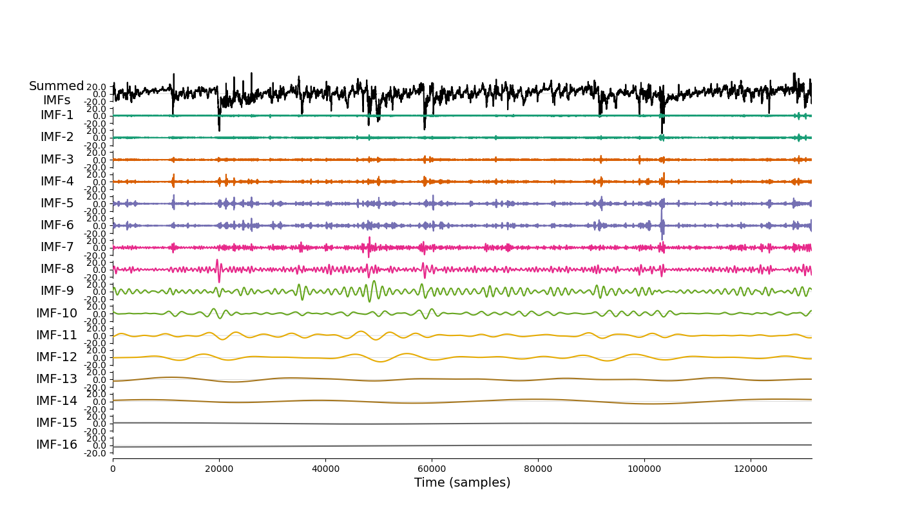 Altogether 16 sifts were found containing decreasing complex signal contributions. 
Summing up all these IMF curves will exactly reconstruct the original data, another important feature of EMD.  
In order to get comparable amount of sifts with similar frequency contents for different data selections you will need to supply 131500 minutes, corresponding to 3 months of geomagnetic data.
This time range is good enough to cover essential periods affecting Sq-variation evolution below seasonal effects. Additionally it is quickly applicable. If you supply less data, the maximum amounts of sifts will be lower.
Nevertheless, individual low-order sifts will contain similar frequency contributions. 

##### Frequency and amplitude characteristics

In a next step we are 
specifically interested in the frequency content of each sift. For this purpose we apply a Hilbert-Huang-transform to analyse distributions of 
instantaneous frequencies, amplitudes and phases of each sift. Results for IMF-6 are shown in Figure 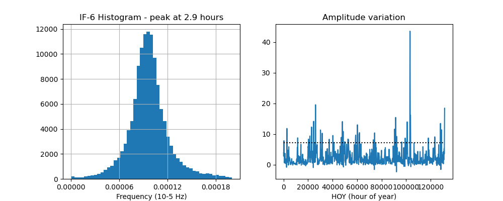 IMF-6 is hereby marking a period of about 3h,
a range which is often used for the general baseline approximation (i.e. for K values).Its amplitude variation indicates a few time ranges containing "disturbed" data characterized by larger amplitude. The dashed line 
is related to the upper inner-quartile limit with a standard factor of 1.5 (i.e. Q3+f*IQR).

If you are interested in determination of Sq baselines based on a frequency related filtering you can stop here already. Recombining all IMF from IMF-6 onwards will correspond to
such frequency based filtering and provide a baseline very similar/almost identical to one used for K-value extraction.

Full application of this technique in MagPy is as follows:

        from magpy.core import activity as act
        data = read("path-to-one-minute-data")
        sqcurce = act.sqbase(data, components=['x','y'], baseline_type='imf')

##### Cyclicity based Sq variation

For this approach we assume that any Sq signal is fully contained within the periodic oscillations that are present in our IMF's.
In order to analyze these oscillations we follow the approach which is described [here](https://emd.readthedocs.io/en/stable/emd_tutorials/03_cycle_ananlysis/index.html) in detail. 
For each IMF we are examining cyclicity and distinguish between good and bad cycles. A good cycle is charcterized by 

a) A strictly positively increasing phase, 
b) A phase starting within phase_step of zero i.e. the lowest value of the instantaneous phase (IP) must be less than phase_step
c) A phase ending within phase_step of 2Pi the highest value of IP must be between 2Pi and 2pi-phase_step
d) A set of 4 unique control points (ascending zero, peak, descending zero & trough)

An example for IMF-9, which contains the most prominent diurnal signal is shown in Figure 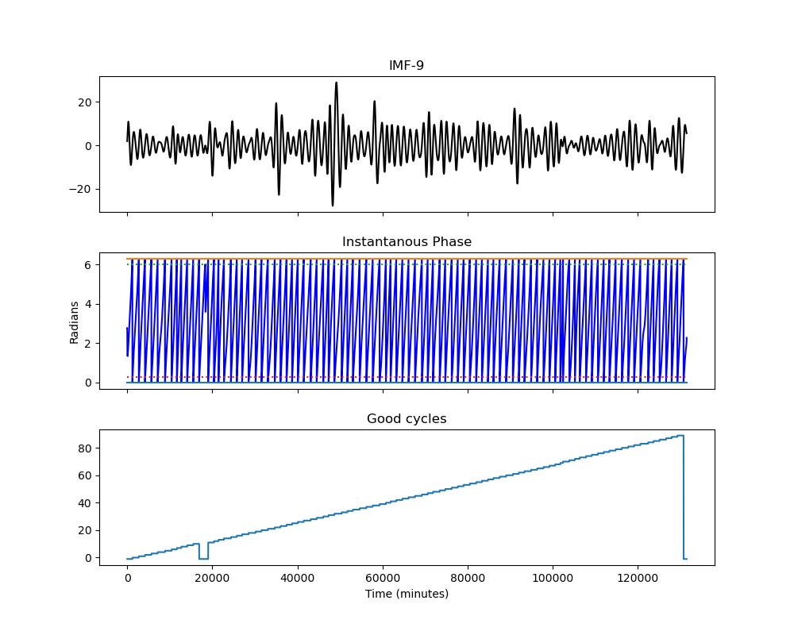 
Cycles not satisfying above criteria are termed "bad" cycles and are masked from the Sq approximation.

Starting with IMF-6 (period 3h) we are then determining a median of the average linear waveforms of identified "good" cycles, by 
running a gliding window of +/- 13 cycles across the investigated timeseries. In order to fill remaining gaps and smooth transitions between individual median cycles, the median cycle IMF is fitted by a cubic spline function with
knots at each data point and using zero weights for non-existing data. The 13-cycle range is related to the dominating diurnal period, for which waveforms
of -13 days + current day + 13 days = 27 days are considered. 27 days correspond to the solar rotation period, containing recurrent solar effects. 
Median IMF-10 and IMF-11 curves are calculated for 13 cycles (covering 27 days for IMF-10). 
For IMF's above 12 (period exceeding 8 days) we are using a simply linear fit of available data, as the average approximated length is significantly below the cycle frequency.

We obtain a running median waveform considering oscillation of the individual IMF's from IMF-6 onwards. Hereby we also excluded HF signal contributions by limiting to 
IMF-6 and larger. The Sq baseline will be a sum of individual median oscillations signals identified within the decomposed signal. Unlike the frequency technique above, 
this method will likely better estimate Sq variations during disturbed periods affecting hours/days. During quiet periods, however, a frequency related method
is likely superior as such methods will remove any non-solar driven multi-day variation (i.e neutral atmosphere, see day2day variability in Haberle et al).

>![IMPORTANT]
> Correct application of the cyclicity analysis requires at least 1 month of one-minute data

Full application of the median Sq technique in MagPy is as follows:

        from magpy.core import activity as act
        data = read("path-to-one-minute-data")
        sqcurce = act.sqbase(data, components=['x','y'], baseline_type='median')

##### Considering solar disturbances affecting low frequencies

The problem of purly frequency based baseline separation is, that during disturbed time of the geomagnetic field 
also longer periods of the geomagnetic field are affected with large amplitudes. A CME for example will affect the 
geomagnetic field for hours to days and thus is not adequately considered using a simple frequency based Sq determination technique.
Low-frequency "periodicities" clearly affected by disturbed time ranges will still be contained and assumed to represent Sq variations.

For a many applications we are primarily interested in detecting significant features of the geomagnetic field of natural and artificial origin. 
CME effects and an optimal description of onset, amplitude and duration certainly belong to these features. Therefore
the "solar quiet" reference baseline, containing untested features should not be biased by features which we are interested in.  

To deal with such effects two approaches are used so far, at least to our knowledge, the method of [SuperMag](), which is not easily reproducible, and the [Haberle]() method. 
Please consider the publication of Veronika Haberele as this approach, comprises the reasoning behind the technique described here, although 
application, theory and methods of MagPy are different.

In principle we are using two characteristics of IMF's in order to identify clearly disturbed time ranges, for which a standard baseline approximation as shown above is not precise.
Firstly we are examining the amplitude variation of an IMF with periods just above the lower Sq period range. Hereby we assume that larger amplitudes are 
connected to disturbances related to solar effects, but still well above the period range of eventually undetected artificial disturbing sources. This is a perfectly valid 
assumption as shown in Fig. 4 (original signal with flags of CME from the CME database).
Based on a statistical standard procedure, we assume time ranges 
(plus-minus a period range) of any IMF-6 amplitude variation data exceeding the upper limit of the inner-quartile range by IQR*1.5 as being disturbed. This approach can be applied 
to any data set independent from location.

Secondly, we analyze the cyclicity of the diurnal signal, which is obviously the most prominent period, and also might be affected by solar effects on the ionospheric current system. For this 
purpose we are analyzing the phase signal of IMF-9 as shown above. Cycles not satisfying above mentioned criteria are termed "bad" cycles and are also removed from the frequency related Sq approximation.
In combination, these two methods will lead to an identification of time ranges for which a simple frequency based
Sq determination technique does presumably not hold. A joint Sq baseline will assume that the median baseline will represent Sq variations better during such disturbed periods. 

Thus, the joint procedure will determine gaps as described above. in a next step a weighting function will be determined with linear transitions between EMD Sq and median Sq curves. 
The weighting function for the median Sq curve is shown in Figure 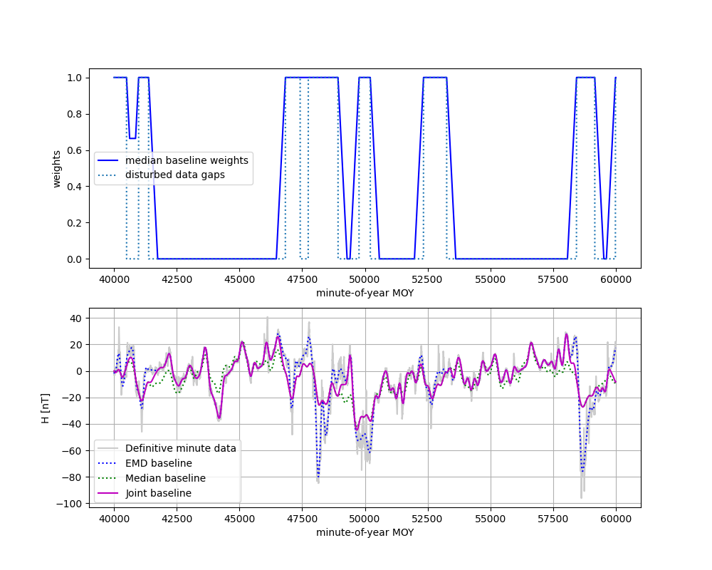 The weighting function of the EMD Sq baseline corresponds to the inverse. 
The window length for the gradual shift from EMD to Median curve is arbitrarily chosen to 12 hours and can be changed by options. 
All three Sq curve approximations are shown in th lower plot.

Full application of the joint Sq technique in MagPy works as follows:

        from magpy.core import activity as act
        data = read("path-to-one-minute-data")
        sqcurce = act.sqbase(data, components=['x','y'], baseline_type='joint')

## 9. MySQL Databases

### 9.1 Database support

MagPy supports database access and many methods for optimizing data treatment in connection with databases. 
Among many other benefits, using a database simplifies many typical procedures related to meta-information. 
Currently, MagPy supports [MySQL] databases. To use these features, you need to have MySQL installed on your system. 
In the following we provide a brief outline of how to set up and use this optional addition. Please note that a 
proper usage of the database requires sensor-specific information. In geomagnetism, it is common to combine data 
from different sensors into one file structure. In this case, such data needs to remain separate for database 
usage and is only combined when producing [IAGA]/[INTERMAGNET] definitive data. Furthermore, unique sensor 
information such as type and serial number is required.

Open mysql (e.g. Linux: `mysql -u root -p mysql`) and create a new database. Replace `#DB-NAME` with your database 
name (e.g. `MyDB`). After creation, you will need to grant privileges to this database to a user of your choice. 
Please refer to official MySQL documentations for details and further commands.

         mysql> CREATE DATABASE #DB-NAME;
         mysql> GRANT ALL PRIVILEGES ON #DB-NAME.* TO '#USERNAME'@'%' IDENTIFIED BY '#PASSWORD';

Thats it! Everything else can now be done using MagPy's database support class, which is based on the pymysql 
module. To enable database support import the following module 

        from magpy.core import database

### 9.2 Basic usage of a MagPy database

Let us assume you have created a database called "mydatabase" and granted access to a user "maxmustermann" with 
password "geheim" on your computer. Connect to the data base:

         db = database.DataBank("localhost","maxmustermann","geheim","mydatabase")

You access the database the first time you need to initialize a new database

         db.dbinit()

This will set up a predefined table structure to be ready for MagPy interaction 
MagPy is a dynamic project - if contents are and internal structure is changing you
can use the `alter` method to updated the table structure to any future version of MagPy

         db.alter()

Add some datastream to the database

         db.write(teststream1)

Add some additional data

         db.write(teststream2)

Reading data is also very simple. Like for standard streams you can also specify *starttime* and *endtime*: 

         data = db.read('Test_0001_0001_0001')

Get some basic information on the current state of the database

         db.info('stdout')

Check if sensorid is already existining - if not create it and fill with header info

         db.sensorinfo('Test_0001_0001', {'SensorName' : 'BestSensorontheGlobe'})

Get some single string from tables

         stationid = db.get_string('DATAINFO', 'Test_0001_0001', 'StationID')
         print (stationid)

Get tablename of sensor

         tablename = db.datainfo(teststream1.header.get('SensorID'), {'DataComment' : 'Add something'}, None, stationid)
         print (tablename)

Generally check if a specific table/data set is existing 

         if db.tableexists('Test_0001_0001_0001'):
             print (" Yes, this table exists")

Get some recent data lines from this table

         data = db.get_lines(tablename, 1000)
         print (len(data))

Get some single numerical data from tables

         sr =  db.get_float('DATAINFO', teststream1.header.get('SensorID'), 'DataSamplingRate')
         print (sr)

Lets put some values into the predefined PIERS table which can be used to store information on all piers of your 
observatories

         pierkeys = ['PierID', 'PierName', 'PierType', 'StationID', 'PierLong', 'PierLat', 'PierAltitude', 'PierCoordinateSystem', 'DeltaDictionary']
         piervalues1 = ['P1','Karl-Heinzens-Supersockel', 'DI', 'TST', 461344.00, 5481745.00,100, 'EPSG:25832', '']
         piervalues2 = ['P2','Hans-Rüdigers-Megasockel', 'DI', 'TST', 461348.00, 5481741.00,101, 'EPSG:25832', '']

We are using the `update` command to insert above defined data into the table PIERS. Please note that the update command
will call an "INSERT INTO" mysql command if no *condition* is given. Thus the command will fail in case of already 
existing inputs. If pier data is already existing add something like *condition="PierID LIKE 'P1'"*.

         db.update('PIERS', pierkeys, piervalues1)
         db.update('PIERS', pierkeys, piervalues2)

The update method can also be used to update basically any information in all other predefined tables

         db.update('SENSORS', ['SensorGroup'], ['magnetism'], condition='SensorID="Test_0001_0001"')

Using select to  generally extract information from any table based on the mysql select command 
db.select(field_of_interest, table, search_criteria

         magsenslist = db.select('SensorID', 'SENSORS', 'SensorGroup = "magnetism"')
         print ("Mag sens", magsenslist)
         tempsenslist = db.select('SensorID', 'SENSORS','SensorElements LIKE "%T%"')
         print ("Temp sens", tempsenslist)
         lasttime = db.select('time', 'Test_0001_0001_0001', expert="ORDER BY time DESC LIMIT 1")
         print ("Last time", lasttime)

There are a few further methods to extract very specific information out of some tables. You can use `get_pier` to 
obtain delta values with respect to other pillars

         value = db.get_pier('P2','P1','deltaF')

The coordinate method is useful to extract coordinates and convert them into any desired new coordinate-system 

         (long, lat) = db.coordinates('P1')

Lets read again some data:

         data = db.read('Test_0001_0001_0001') # test with all options sql, starttime, endtime

Please note: MagPy2.0 is approximately 14 times faster then MagPy1.x for such operations.

         data.header['DataSensorOrientation'] = 'HEZ'

Let us change the header information of the data set and then update only the database's header information by the new data header

         db.update_datainfo('Test_0001_0001_0001', data.header)

Delete contents - the following call delete everything except the last day of data. The option samplingrateratio can 
be used to delete  data in dependency of the sampling rate i.e. samplingrateratio=12 will delete everything older 
then 12 days with sampling period 1 sec and everything older the 60*12 = 720 days for sampling periods 60 sec. 
Together with archive functions and optimze sql routines this method is useful to keep the database slim and quick for 
recent data

         db.delete('Test_0001_0001_0001', timerange=1)

If you want to delete the data base completely use mysql commands

### 9.3 Flagging and databases

Working with flagging information is also supported by the database class. There are three methods which can be
used to store and read flags from databases. An existing flagging object can be stored in the database using the
following command assuming you flags are contained in variable *fl*

        db.flags_to_db(fl)

Reading flags from the database is done similar. Possible options are starttime, endtime, sensorid, comment, key and
flagtype:

        flnew = db.flags_from_db()

If you want to delete specific flags from the data base use the `flag_to_delete` command and define a parameter and 
associated value. Parameter "all" will delete all existing flags in the database

        db.flags_to_delete(parameter="operator", value="RL")

### 9.4 Absolutes and databases

Text

## 10. Additional methods and functions

### 10.1 Testing data validity before submissions to IM and IAGA

A common and important application used in the geomagnetism community is a general validity check of geomagnetic data to be submitted to the official data repositories [IAGA], WDC, or [INTERMAGNET]. Please note: this is currently under development and will be extended in the near future. A 'one-click' test method will be included in xmagpy in the future, checking:

A) Validity of data formats, e.g.:

        data = read('myiaffile.bin', debug=True)

B) Completeness of meta-information

C) Conformity of applied techniques to respective rules

D) Internal consistency of data

E) Optional: regional consistency

### 10.2 Spectral Analysis and Noise

For analysis of the spectral content of data, MagPy provides two basic plotting methods. `plotPS` will calculate and display a power spectrum of the selected component. `plotSpectrogram` will plot a spectrogram of the time series. As usual, there are many options for plot window and processing parameters that can be accessed using the help method.

        data = read(example1)
        mp.plotPS(data,key='f')
        mp.plotSpectrogram(data,['f'])

### 10.3 The art of meta-information

Each data set is accompanied by a dictionary containing meta-information for this data. This dictionary is completely dynamic and can be filled freely, but there are a number of predefined fields that help the user provide essential meta-information as requested by [IAGA], [INTERMAGNET] and other data providers. All meta information is saved only to MagPy-specific archive formats PYCDF and PYSTR. All other export formats save only specific information as required by the projected format.

The current content of this dictionary can be accessed by:

        data = read(example1)
        print(data.header)

Information is added/changed by using:

        data.header['SensorName'] = 'FGE'

Individual information is obtained from the dictionary using standard key input:

        print(data.header.get('SensorName'))

If you want to have a more readable list of the header information, do:

        for key in data.header:
            print ("Key: {} \t Content: {}".format(key,data.header.get(key)))

#### 10.4.1 Conversion to ImagCDF - Adding meta-information

To convert data from [IAGA] or IAF formats to the new [INTERMAGNET] CDF format, you will usually need to add additional meta-information required for the new format. MagPy can assist you here, firstly by extracting and correctly adding already existing meta-information into newly defined fields, and secondly by informing you of which information needs to be added for producing the correct output format.

Example of IAGA02 to ImagCDF:

        mydata = read('IAGA02-file.min')
        mydata.write('/tmp',format_type='IMAGCDF')

The console output of the write command (see below) will tell you which information needs to be added (and how) in order to obtain correct ImagCDF files. Please note, MagPy will store the data in any case and will be able to read it again even if information is missing. Before submitting to a GIN, you need to make sure that the appropriate information is contained. Attributes that relate to publication of the data will not be checked at this point, and might be included later.

        >>>Writing IMAGCDF Format /tmp/wic_20150828_0000_PT1M_4.cdf
        >>>writeIMAGCDF: StandardLevel not defined - please specify by yourdata.header['DataStandardLevel'] = ['None','Partial','Full']
        >>>writeIMAGCDF: Found F column
        >>>writeIMAGCDF: given components are XYZF. Checking F column...
        >>>writeIMAGCDF: analyzed F column - values are apparently independend from vector components - using column name 'S'

Now add the missing information. Selecting 'Partial' will require additional information. You will get a 'reminder' if you forget this. Please check IMAGCDF instructions on specific codes:

        mydata.header['DataStandardLevel'] = 'Partial'
        mydata.header['DataPartialStandDesc'] = 'IMOS-01,IMOS-02,IMOS-03,IMOS-04,IMOS-05,IMOS-06,IMOS-11,IMOS-12,IMOS-13,IMOS-14,IMOS-15,IMOS-21,IMOS-22,IMOS-31,IMOS-41'

Similar reminders to fill out complete header information will be shown for other conversions like:

        mydata.write('/tmp',format_type='IAGA')
        mydata.write('/tmp',format_type='IMF')
        mydata.write('/tmp',format_type='IAF',coverage='month')
        mydata.write('/tmp',format_type='WDC')

#### 10.4.2 Providing location data

Providing location data usually requires information on the reference system (ellipsoid,...). By default MagPy assumes that these values are provided in WGS84/WGS84 reference system. In order to facilitate most easy referencing and conversions, MagPy supports [EPSG] codes for coordinates. If you provide the geodetic references as follows, and provided that the [proj4] Python module is available, MagPy will automatically convert location data to the requested output format (currently WGS84).

        mydata.header['DataAcquisitionLongitude'] = -34949.9
        mydata.header['DataAcquisitionLatitude'] = 310087.0
        mydata.header['DataLocationReference'] = 'GK M34, EPSG: 31253'

        >>>...
        >>>writeIMAGCDF: converting coordinates to epsg 4326
        >>>...

#### 10.4.3 Special meta-information fields

The meta-information fields can hold much more information than required by most output formats. This includes basevalue and baseline parameters, flagging details, detailed sensor information, serial numbers and much more. MagPy makes use of these possibilities. In order to save this meta-information along with your data set you can use MagPy internal archiving format, `PYCDF`, which can later be converted to any of the aforementioned output formats. You can even reconstruct a full data base. Any upcoming meta-information or output request can be easily added/modified without disrupting already existing data sets and the ability to read and analyse old data. This data format is also based on Nasa CDF. ASCII outputs are also supported by MagPy, of which the `PYSTR` format also contains all meta information and `PYASCII` is the most compact. Please consider that ASCII formats require a lot of memory, especially for one second and higher resolution data.

        mydata.write('/tmp',format_type='PYCDF',coverage='year')

### 11 Data transfer

MagPy contains a number of methods to simplify data transfer for observatory applications. Methods within the basic Python functionality can also be very useful. Using the implemented methods requires:

        from magpy import transfer as mt

#### 11.10.1 Downloads

Use the `read` method as outlined above. No additional imports are required.

#### 11.10.2 FTP upload

Files can also be uploaded to an FTP server:

        mt.ftpdatatransfer(localfile='/path/to/data.cdf',ftppath='/remote/directory/',myproxy='ftpaddress or address of proxy',port=21,login='user',passwd='passwd',logfile='/path/mylog.log')

The upload methods using FTP, SCP and GIN support logging. If the data file failed to upload correctly, the path is added to a log file and, when called again, upload of the file is retried. This option is useful for remote locations with unstable network connections.

#### 11.10.3 Secure communication protocol (SCP)

To transfer via SCP:

        mt.scptransfer('user@address:/remote/directory/','/path/to/data.cdf',passwd,timeout=60)

#### 11.10.4 Upload data to GIN

Use the following command:

        mt.ginupload('/path/to/data.cdf', ginuser, ginpasswd, ginaddress, faillog=True, stdout=True)

#### 11.10.5 Avoiding real-text passwords in scripts

In order to avoid using real-text password in scripts, MagPy comes along with a simple encryption routine.

        from magpy.opt import cred as mpcred

Credentials will be saved to a hidden file with encrypted passwords. To add information for data transfer to a machine called 'MyRemoteFTP' with an IP of 192.168.0.99:

        mpcred.cc('transfer', 'MyRemoteFTP', user='user', passwd='secure', address='192.168.0.99', port=21)

Extracting passwd information within your data transfer scripts:

        user = mpcred.lc('MyRemoteFTP', 'user')
        password = mpcred.lc('MyRemoteFTP','passwd')

##### Citations

To be added

### 12.13 Monitoring scheduled scripts

Automated analysis can e easily accomplished by adding a series of MagPy commands into a script. A typical script could be:

        # read some data and get means
        data = read(example1)
        mean_f = data.mean('f')

        # import monitor method
        from magpy.opt import Analysismonitor
        analysisdict = Analysismonitor(logfile='/var/log/anamon.log')
        analysisdict = analysisdict.load()
        # check some arbitray threshold
        analysisdict.check({'data_threshold_f_GSM90': [mean_f,'>',20000]})

If provided criteria are invalid, then the logfile is changed accordingly. This method can assist you particularly in checking data actuality, data contents, data validity, upload success, etc. In combination with an independent monitoring tool like [Nagios], you can easily create mail/SMS notfications of such changes, in addition to monitoring processes, live times, disks etc. [MARCOS] comes along with some instructions on how to use Nagios/MagPy for data acquisition monitoring.

### 12.14 Data acquisition support

MagPy contains a couple of modules which can be used for data acquisition, collection and organization. These methods are primarily contained in two applications: [MARTAS] and [MARCOS]. MARTAS (Magpy Automated Realtime Acquisition System) supports communication with many common instruments (e.g. GSM, LEMI, POS1, FGE, and many non-magnetic instruments) and transfers serial port signals to [WAMP] (Web Application Messaging Protocol), which allows for real-time data access using e.g. WebSocket communication through the internet. MARCOS (Magpy's Automated Realtime Collection and Organistaion System) can access such real-time streams and also data from many other sources and supports the observer by storing, analyzing, archiving data, as well as monitoring all processes. Details on these two applications can be found elsewhere.

### 12.15 Graphical user interface

Many of the above mentioned methods are also available within the graphical user interface of MagPy.
To use this check the installation instructions for your operating system. You will find Video Tutorials online (to be added) describing its usage for specific analyses.

### 12.16 Current developments

#### 12.16.1 Exchange data objects with [ObsPy]

MagPy supports the exchange of data with ObsPy, the seismological toolbox. Data objects of both python packages are very similar. Note: ObsPy assumes regular spaced time intervals. Please be careful if this is not the case with your data. The example below shows a simple import routine, on how to read a seed file and plot a spectrogram (which you can identically obtain from ObsPy as well). Conversions to MagPy allow for vectorial analyses, and geomagnetic applications. Conversions to ObsPy are useful for effective high frequency analysis, requiring evenly spaced time intervals, and for exporting to seismological data formats.

        from obspy import read as obsread
        seeddata = obsread('/path/to/seedfile')
        magpydata = obspy2magpy(seeddata,keydict={'ObsPyColName': 'x'})
        mp.plotSpectrogram(magpydata,['x'])

Possible issues with MagPy and ObsPy on the same machine as obspy requires specific, eventually conflicting scipy/numpy modules:
If you observe such problems, consider installing ObsPy via APT

  https://github.com/obspy/obspy/wiki/Installation-on-Linux-via-Apt-Repository

Afterwards you can install magpy as described above.
Using essential python3 packages from apt is also useful, if dependency problems are observerd:

        sudo apt install python3-scipy, python3-matplotlib, python3-numpy

#### 12.16.2 Flagging in ImagCDF

        datawithspikes = read(example1)
        flaggeddata = datawithspikes.flag_outlier(keys=['f'],timerange=timedelta(minutes=1),threshold=3)
        mp.plot(flaggeddata,['f'],annotate=True)
        flaggeddata.write(tmpdir,format_type='IMAGCDF',addflags=True)

The `addflags` option denotes that flagging information will be added to the ImagCDF format. Please note that this is still under development and thus content and format specifications may change. So please use it only for test purposes and not for archiving. To read and view flagged ImagCDF data, just use the normal read command, and activate annotation for plotting.

        new = read('/tmp/cnb_20120802_000000_PT1S_1.cdf')
        mp.plot(new,['f'],annotate=True)

## 13. Predefined scripts

MagPy comes with a steadily increasing number of applications for various purposes. These applications can be run from some command prompt and allow to simplify/automize some commonly used applications of MagPy. All applications have the same syntax, consisting of the name of application and options. The option -h is available for all applications and provides an overview about purpose and options of the application:

        $> application -h

### 13.1 Running applications in Linux/MacOs

On Linux Systems all applications are added the bin directory and can be run directly from any command interface/terminal after installation of MagPy:

        $> application -h

### 13.2 Running applications in Windows

After installing MagPy/GeomagPy on Windows, three executables are found in the MagPy program folder. For running applications you have to start the MagPy "command prompt". In this terminal you will have to go to the Scripts directory:

        .../> cd Scripts

And here you now can run the application of your choice using the python environment:

        .../Scripts>python application -h

### 13.3 Applications

The available applications are briefly intruduced in the following. Please refer to "application -h" for all available options for each application.

#### 13.3.1 mpconvert

mpconvert converts bewteen data formats based on MagPy.
Typical applications are the conversion of binary data formats
to readable ASCII data sets or the conversion.

Typical applications include

a) Convert IAGA seconds to IMAGCDF and include obligatory meta information:

        mpconvert -r "/iagaseconds/wic201701*" -f IMAGCDF -c month -w "/tmp"
                     -m "DataStandardLevel:Full,IAGACode:WIC,DataReferences:myref"

b) Convert IMAGCDF seconds to IAF minute (using IAGA/IM filtering procedures):

        mpconvert -r "/imagcdf/wic_201701_000000_PT1S_4.cdf" -f IAF -i -w "/tmp"

mpconvert -r "/srv/products/data/magnetism/definitive/wic2017/ImagCDF/wic_201708_000000_PT1S_4.cdf" -f IAF -i -w "/tmp"

#### 13.3.2 addcred

Used to store encrypted credential information for automatic data transfer. So that sensitive information has not to be written in plain text in scripts or cron jobs.

a) Add information for ftp data transfer. This information is encrypted and can be accessed by referring to the shortcut "zamg".

        addcred -t transfer -c zamg -u max -p geheim
                  -a "ftp://ftp.remote.ac.at" -l 21

## 14. List of all MagPy methods

Please use the help method (section 2.3) for descriptions and return values.

| group | method | parameter |
| ----- | ------ | --------- |
| - | **findpath** | name, path |
| - | **_pickle_method** | method |
| - | **_unpickle_method** | func_name, obj, cls |
| stream | **__init__** | self, container=None, header={},ndarray=None |
| stream | **ext** | self, columnstructure |
| stream | **add** | self, datlst |
| stream | **length** | self |
| stream | **replace** | self, datlst |
| stream | **copy** | self |
| stream | **__str__** | self |
| stream | **__repr__** | self |
| stream | **__getitem__** | self, index |
| stream | **__len__** | self |
| stream | **clear_header** | self |
| stream | **extend** | self,datlst,header,ndarray |
| stream | **union** | self,column |
| stream | **removeduplicates** | self |
| stream | **start** | self, dateformt=None |
| stream | **end** | self, dateformt=None |
| stream | **findtime** | self,time,**kwargs |
| stream | **_find_t_limits** | self |
| stream | **_print_key_headers** | self |
| stream | **_get_key_headers** | self,**kwargs |
| stream | **_get_key_names** | self |
| stream | **dropempty** | self |
| stream | **fillempty** | self, ndarray, keylist |
| stream | **sorting** | self |
| stream | **_get_line** | self, key, value |
| stream | **_take_columns** | self, keys |
| stream | **_remove_lines** | self, key, value |
| stream | **_get_column** | self, key |
| stream | **_put_column** | self, column, key, **kwargs |
| stream | **_move_column** | self, key, put2key |
| stream | **_drop_column** | self,key |
| stream | **_clear_column** | self, key |
| stream | **_reduce_stream** | self, pointlimit=100000 |
| stream | **_remove_nancolumns** | self |
| stream | **_aic** | self, signal, k, debugmode=None |
| stream | **harmfit** | self,nt, val, fitdegree |
| stream | **_get_max** | self, key, returntime=False |
| stream | **_get_min** | self, key, returntime=False |
| stream | **amplitude** | self,key |
| stream | **_gf** | self, t, tau |
| stream | **_hf** | self, p, x |
| stream | **_residual_func** | self, func, y |
| stream | **_tau** | self, period, fac=0.83255461 |
| stream | **_convertstream** | self, coordinate, **kwargs |
| stream | **_delete** | self,index |
| stream | **_append** | self,stream |
| stream | **_det_trange** | self, period |
| stream | **_is_number** | self, s |
| stream | **_normalize** | self, column |
| stream | **_testtime** | self, time |
| stream | **_drop_nans** | self, key |
| stream | **_select_keys** | self, keys |
| stream | **_select_timerange** | self, starttime=None, endtime=None, maxidx=-1 |
| stream | **aic_calc** | self, key, **kwargs |
| stream | **baseline** | self, absolutedata, **kwargs |
| stream | **stream2dict** | self, keys=['dx','dy','dz'], dictkey='DataBaseValues' |
| stream | **dict2stream** | self,dictkey='DataBaseValues' |
| stream | **baselineAdvanced** | self, absdata, baselist, **kwargs |
| stream | **bc** | self, function=None, ctype=None, alpha=0.0,level='preliminary' |
| stream | **bindetector** | self,key,flagnum=1,keystoflag=['x'],sensorid=None,text=None,**kwargs |
| stream | **calc_f** | self, **kwargs |
| stream | **dailymeans** | self, keys=['x','y','z','f'], **kwargs |
| stream | **date_offset** | self, offset |
| stream | **delta_f** | self, **kwargs |
| stream | **f_from_df** | self, **kwargs |
| stream | **differentiate** | self, **kwargs |
| stream | **DWT_calc** | self,key='x',wavelet='db4',level=3,plot=False,outfile=None,
| stream | **eventlogger** | self, key, values, compare=None, stringvalues=None, addcomment=None, debugmode=None |
| stream | **extract** | self, key, value, compare=None, debugmode=None |
| stream | **extract2** | self, keys, get='>', func=None, debugmode=None |
| stream | **extrapolate** | self, start, end |
| stream | **filter** | self,**kwargs |
| stream | **fit** | self, keys, **kwargs |
| stream | **extractflags** | self |
| stream | **flagfast** | self,indexarray,flag, comment,keys=None |
| stream | **flag_range** | self, **kwargs |
| stream | **flag_outlier** | self, **kwargs |
| stream | **flag** | self, flaglist, removeduplicates=False, debug=False |
| stream | **flagliststats** | self,flaglist |
| stream | **flaglistclean** | self,flaglist |
| stream | **stream2flaglist** | self, userange=True, flagnumber=None, keystoflag=None, sensorid=None, comment=None |
| stream | **flaglistmod** | self, mode='select', flaglist=[], parameter='key', value=None, newvalue=None |
| stream | **flaglistadd** | self, flaglist, sensorid, keys, flagnumber, comment, startdate, enddate=None |
| stream | **flag_stream** | self, key, flag, comment, startdate, enddate=None, samplingrate=0., debug=False |
| stream | **simplebasevalue2stream** | self,basevalue,**kwargs |
| stream | **func2stream** | self,function,**kwargs |
| stream | **func_add** | self,function,**kwargs |
| stream | **func_subtract** | self,function,**kwargs |
| stream | **get_gaps** | self, **kwargs |
| stream | **get_rotationangle** | self, xcompensation=0,keys=['x','y','z'],**kwargs |
| stream | **get_sampling_period** | self |
| stream | **samplingrate** | self, **kwargs |
| stream | **integrate** | self, **kwargs |
| stream | **interpol** | self, keys, **kwargs |
| stream | **k_extend** | self, **kwargs |
| stream | **k_fmi** | self, **kwargs |
| stream | **linestruct2ndarray** | self |
| stream | **mean** | self, key, **kwargs |
| stream | **missingvalue** | self,v,window_len,threshold=0.9,fill='mean' |
| stream | **MODWT_calc** | self,key='x',wavelet='haar',level=1,plot=False,outfile=None |
| stream | **multiply** | self, factors, square=False |
| stream | **offset** | self, offsets, **kwargs |
| stream | **plot** | self, keys=None, debugmode=None, **kwargs |
| stream | **powerspectrum** | self, key, debugmode=None, outfile=None, fmt=None, axes=None, title=None,**kwargs |
| stream | **randomdrop** | self,percentage=None,fixed_indicies=None |
| stream | **remove** | self, starttime=None, endtime=None |
| stream | **remove_flagged** | self, **kwargs |
| stream | **remove_outlier** | self, **kwargs |
| stream | **resample** | self, keys, **kwargs |
| stream | **rotation** | self,**kwargs |
| stream | **scale_correction** | self, keys, scales, **kwargs |
| stream | **selectkeys** | self, keys, **kwargs |
| stream | **smooth** | self, keys=None, **kwargs |
| stream | **spectrogram** | self, keys, per_lap=0.9, wlen=None, log=False,
| stream | **steadyrise** | self, key, timewindow, **kwargs |
| stream | **stereoplot** | self, **kwargs |
| stream | **trim** | self, starttime=None, endtime=None, newway=False |
| stream | **variometercorrection** | self, variopath, thedate, **kwargs |
| stream | **_write_format** | self, format_type, filenamebegins, filenameends, coverage, dateformat,year |
| stream | **write** | self, filepath, compression=5, **kwargs |
| stream | **idf2xyz** | self,**kwargs |
| stream | **xyz2idf** | self,**kwargs |
| stream | **xyz2hdz** | self,**kwargs |
| stream | **hdz2xyz** | self,**kwargs |
| - | **coordinatetransform** | u,v,w,kind |
| - | **isNumber** | s |
| - | **find_nearest** | array,value |
| - | **ceil_dt** | dt,seconds |
| - | **read** | path_or_url=None, dataformat=None, headonly=False, **kwargs |
| - | **_read** | filename, dataformat=None, headonly=False, **kwargs |
| - | **saveflags** | mylist=None,path=None |
| - | **loadflags** | path=None,sensorid=None,begin=None, end=None |
| - | **joinStreams** | stream_a,stream_b, **kwargs |
| - | **appendStreams** | streamlist |
| - | **mergeStreams** | stream_a, stream_b, **kwargs |
| - | **dms2d** | dms |
| - | **find_offset** | stream1, stream2, guess_low=-60., guess_high=60. |
| - | **diffStreams** | stream_a, stream_b, **kwargs |
| - | **subtractStreams** | stream_a, stream_b, **kwargs |
| - | **stackStreams** | streamlist, **kwargs |
| - | **compareStreams** | stream_a, stream_b |
| - | **array2stream** | listofarrays, keystring,starttime=None,sr=None |
| - | **obspy2magpy** | opstream, keydict={} |
| - | **extractDateFromString** | datestring |
| - | **testTimeString** | time |
| - | **denormalize** | column, startvalue, endvalue |
| - | **find_nearest** | array, value |
| - | **maskNAN** | column |
| - | **nan_helper** | y |
| - | **nearestPow2** | x |
| - | **test_time** | time |
| - | **convertGeoCoordinate** | lon,lat,pro1,pro2 |
| mpplot | **ploteasy** | stream |
| mpplot | **plot_new** | stream,variables=[],specialdict={},errorbars=False,padding=0,noshow=False |
| mpplot | **plot** | stream,variables=[],specialdict={},errorbars=False,padding=0,noshow=False |
| mpplot | **plotStreams** | streamlist,variables,padding=None,specialdict={},errorbars=None |
| mpplot | **toggle_selector** | event |
| mpplot | **addFlag** | data, flagger, indeciestobeflagged, variables |
| mpplot | **plotFlag** | data,variables=None,figure=False |
| mpplot | **plotEMD** | stream,key,verbose=False,plottitle=None |
| mpplot | **plotNormStreams** | streamlist, key, normalize=True, normalizet=False |
| mpplot | **plotPS** | stream,key,debugmode=False,outfile=None,noshow=False |
| mpplot | **plotSatMag** | mag_stream,sat_stream,keys,outfile=None,plottype='discontinuous' |
| mpplot | **plotSpectrogram** | stream, keys, NFFT=1024, detrend=mlab.detrend_none |
| mpplot | **magpySpecgram** | x, NFFT=256, Fs=2, Fc=0, detrend=mlab.detrend_none |
| mpplot | **plotStereoplot** | stream,focus='all',colorlist = ['b','r','g','c','m','y','k'] |
| mpplot | **_plot** | data,savedpi=80,grid=True,gridcolor=gridcolor,noshow=False |
| mpplot | **_confinex** | ax, tmax, tmin, timeunit |
| mpplot | **_extract_data_for_PSD** | stream, key |
| database | **dbgetPier** | db,pierid, rp, value, maxdate=None, l=False, dic='DeltaDictionary' |
| database | **dbgetlines** | db, tablename, lines |
| database | **dbupdate** | db,tablename, keys, values, condition=None |
| database | **dbgetfloat** | db,tablename,sensorid,columnid,revision=None |
| database | **dbgetstring** | db,tablename,sensorid,columnid,revision=None |
| database | **dbupload** | db, path,stationid,**kwargs |
| database | **dbinit** | db |
| database | **dbdelete** | db,datainfoid,**kwargs |
| database | **dbdict2fields** | db,header_dict,**kwargs |
| database | **dbfields2dict** | db,datainfoid |
| database | **dbalter** | db |
| database | **dbselect** | db, element, table, condition=None, expert=None, debug=False |
| database | **dbcoordinates** | db, pier, epsgcode='epsg:4326' |
| database | **dbsensorinfo** | db,sensorid,sensorkeydict=None,sensorrevision = '0001' |
| database | **dbdatainfo** | db,sensorid,datakeydict=None,tablenum=None,defaultstation='WIC',updatedb=True |
| database | **writeDB** | db, datastream, tablename=None, StationID=None, mode='replace', revision=None, debug=False, **kwargs |
| database | **dbsetTimesinDataInfo** | db, tablename,colstr,unitstr |
| database | **dbupdateDataInfo** | db, tablename, header |
| database | **stream2db** | db, datastream, noheader=None, mode=None, tablename=None, **kwargs |
| database | **readDB** | db, table, starttime=None, endtime=None, sql=None |
| database | **db2stream** | db, sensorid=None, begin=None, end=None, tableext=None, sql=None |
| database | **diline2db** | db, dilinestruct, mode=None, **kwargs |
| database | **db2diline** | db,**kwargs |
| database | **applyDeltas** | db, stream |
| database | **getBaseline** | db,sensorid, date=None |
| database | **flaglist2db** | db,flaglist,mode=None,sensorid=None,modificationdate=None |
| database | **db2flaglist** | db,sensorid, begin=None, end=None, comment=None, flagnumber=-1, key=None, removeduplicates=False |
| database | **string2dict** | string |
| tranfer | **_checklogfile** | logfile |
| tranfer | **ftpdatatransfer** | **kwargs |
| tranfer | **_missingvals** | myproxy, port, login, passwd, logfile |
| tranfer | **scptransfer** | src,dest,passwd,**kwargs |
| tranfer | **ssh_remotefilelist** | remotepath, filepat, user, host, passwd |
| tranfer | **ginupload** | filename=None, user=None, password=None, url=None,**kwargs |
| tranfer | **ftpdirlist** | **kwargs |
| tranfer | **ftpremove** | **kwargs |
| tranfer | **ftpget** | ftpaddress,ftpname,ftppasswd,remotepath,localpath,identifier,port=None,**kwargs |

## 15. Appendix

### 15.1 Extended installation instructions

        $ sudo apt-get install libproj-dev proj-data proj-bin

On Linux this will look like:

        $ sudo apt-get install python-matplotlib python-scipy python-h5py cython python-pip  
        $ sudo apt-get install python-wxgtk3.0 # or python-wxgtk2.8 (Debian Stretch)  
        $ sudo apt-get install python-twisted  
        $ sudo pip install ffnet
        $ sudo pip install pyproj==1.9.5
        $ sudo pip install pyserial
        $ sudo pip install service_identity
        $ sudo pip install ownet
        $ sudo pip install spacepy
        $ sudo pip install geomagpy  

On Mac and Windows you need to download a python interpreter like [Anaconda] or [WinPython] and then install similar packages, particluarly the old wxpython 3.x.

   [magpy-git]: <https://github.com/geomagpy/magpy>
   [magpy_win]: <http://www.conrad-observatory.at>
   [epsg]: <https://www.epsg-registry.org/>
   [proj4]: <https://github.com/OSGeo/proj.4>
   [MySQL]: <https://www.mysql.com/>
   [INTERMAGNET]: <http://www.intermagnet.org>
   [IAGA]: <http://www.iaga-aiga.org/>
   [WAMP]: <http://wamp-proto.org/>
   [MARTAS]: <https://github.com/geomagpy/MARTAS>
   [MARCOS]: <https://github.com/geomagpy/MARCOS>
   [MacPorts]: <https://www.macports.org/>
   [Miniconda]: <https://docs.conda.io/en/latest/miniconda.html>
   [Anaconda]: <https://www.continuum.io/downloads>
   [Docker]: <https://www.docker.com/>
   [CDF]: <https://cdf.gsfc.nasa.gov/>
   [ObsPy]: <https://github.com/obspy/obspy>
   [Nagios]: <https://www.nagios.org/>
   [Telegram]: <https://t.me/geomagpy>
   [MagPy Windows installer]: <https://cobs.zamg.ac.at/data/index.php/en/downloads/category/1-magnetism>
   [An introduction to XMagPy]: <https://github.com/geomagpy/magpy/blob/master/magpy/doc/xmagpy-manual.pdf>
